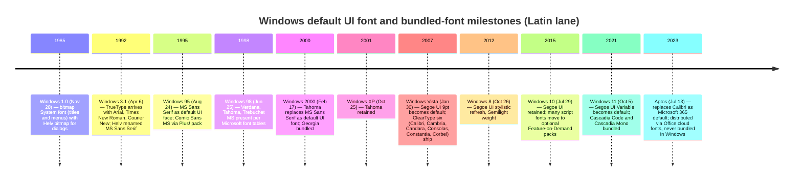
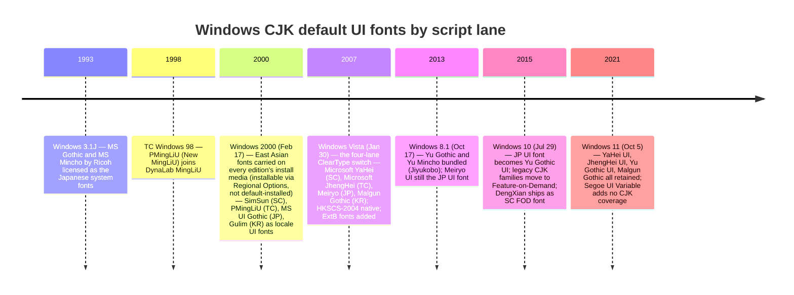
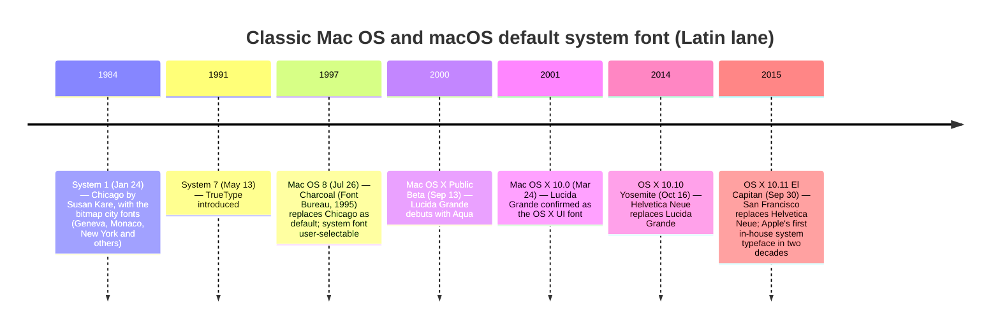
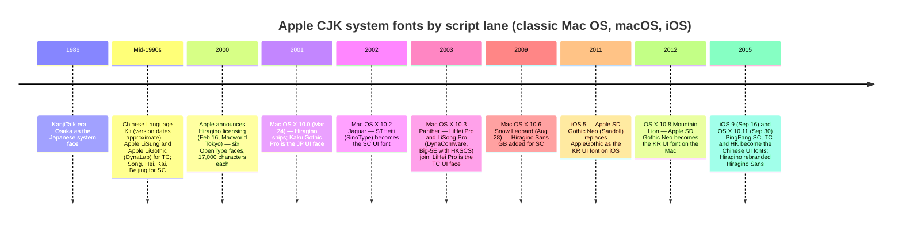
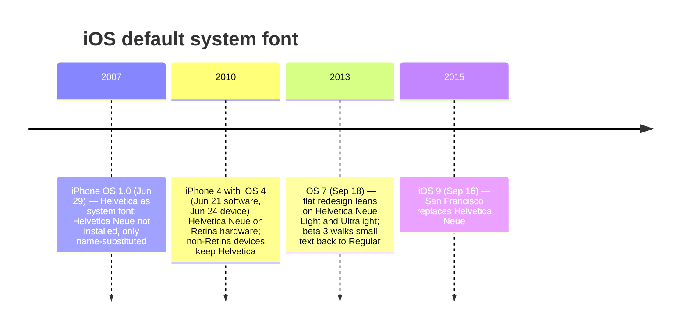
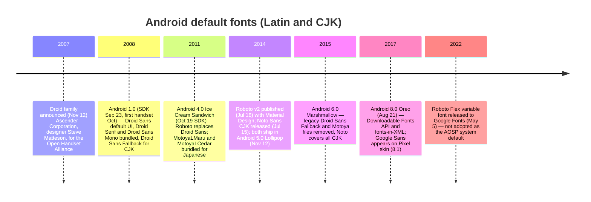
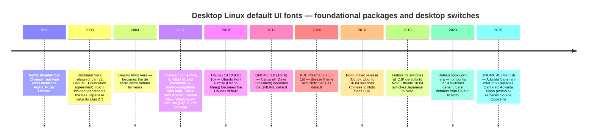
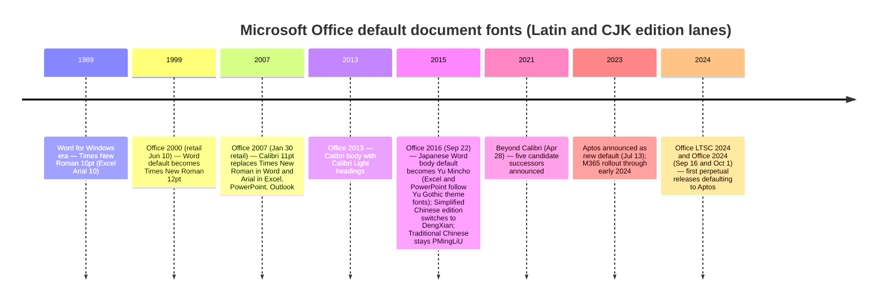
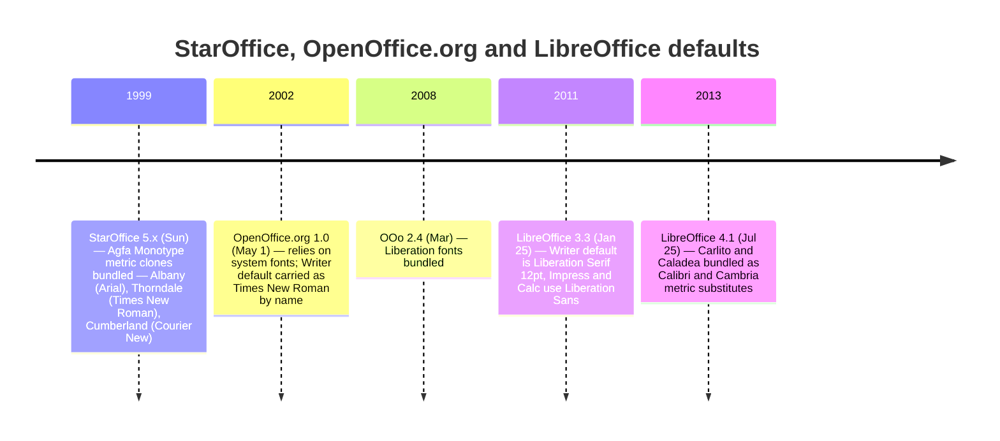
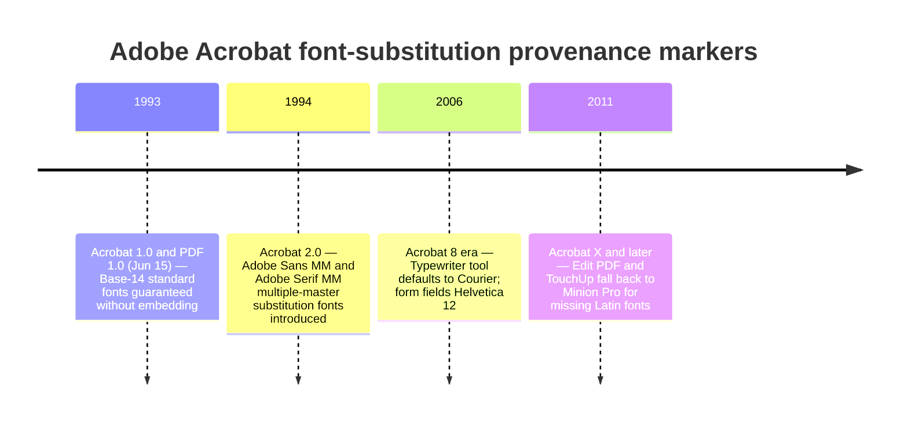

# Bundled Fonts and Default-Typeface Changes in Major Operating Systems, Office Suites, and Document Tooling: A Provenance Timeline Reference

**Albert Hui** · Draft of 2026-07-24 · Working paper

## Abstract

The set of fonts bundled with an operating system or application, and the *default* typeface each release binds to its user interface and to new documents, change at datable public releases. Those dates bound the earliest time an artifact could have acquired the font through ordinary public channels (pre-release access — foundries, beta programs, OEMs — is the caveat), and default-font choices identify candidate producing software. This paper assembles verified timelines of (1) default system/UI font changes and bundled-font milestones in Windows, macOS, iOS, Android, and desktop Linux, including per-script CJK lanes (Simplified Chinese, Traditional Chinese, Hong Kong, Japanese, Korean); (2) default document-font changes in major office suites (Microsoft Office including its East Asian editions, OpenOffice.org/LibreOffice, WPS Office, Google Docs, Apple iWork, JustSystems Ichitaro, Hancom Office); (3) default and substitution fonts in PDF and scan/OCR tooling (Adobe Acrobat/Reader, PaperPort and OCR peers); and (4) default-font and font-substitution behavior in document-generation libraries (the Aspose suites and peers). Events are cited to the most authoritative sources located, with hotlinked URLs, and citations are annotated with verification tiers; where only secondary or incomplete sourcing was found, the citation and the claim say so, and claims that could not be adequately verified are labeled UNCERTAIN.

## 1. Introduction

A font cannot appear in a document before the font is available. The canonical demonstration is the Calibri affair of 2017 ("Fontgate"), in which property documents represented as executed in **February 2006** were typeset in Calibri — a font that first became publicly obtainable with Office 2007 Beta 2 on 2006-05-23 and generally available with Windows Vista and Office 2007 on 2007-01-30. The February 2006 dating is the decisive detail: the documents predate even the public beta, which featured in Pakistan's Supreme Court proceedings against the Sharif family.[^intro-fontgate] Beyond first-availability bounds, *default* fonts carry a second, weaker signal: they identify the factory configuration of candidate producing software. This reasoning is asymmetric. A font used before its earliest public availability is decisive (an anachronism); a default-font match is only *consistent with* a toolchain, never proof of it, because users change defaults, templates override them, and fonts travel. Read this way: a PDF whose text layer is set in Fanwood, accompanied by Aspose's characteristic substitution warning or metadata, is strong evidence of Aspose.Words rendering on a font-starved Linux host (§6); text in Adobe Sans MM is consistent with Acrobat rendering a PDF whose fonts were missing (§5); a Simplified-Chinese document body in 等线 (DengXian) cannot predate 2015-07-29 (the font's first ship, in Windows 10) and is consistent with the Office 2016-era Simplified-Chinese default path (§4.1).

This paper is a dated, sourced reference for such reasoning. Each platform or product gets an Aeon-Timeline-style lane view (rendered as a Mermaid timeline) plus an event register with citations.

[^intro-fontgate]: BBC Trending, "The font that may bring down Pakistan's Sharif dynasty" (the "Fontgate" Calibri dating controversy), BBC, 2017-07, <https://www.bbc.com/news/blogs-trending-40571708> [verified live]. Calibri availability dates per Microsoft/Wikipedia sources in §3.1.

## 2. Method and evidence tiers

**Search protocol.** Research was conducted in July 2026 by parallel per-platform investigations, each proceeding: (1) general web search to locate candidate sources for each event; (2) preference-ordered source selection — vendor primary documentation (Microsoft Learn/Typography, Apple Newsroom/Support/Developer, Android Developers Blog, project release notes and bug trackers, vendor API references), then institutional records (Computer History Museum, SEC EDGAR), then first-person designer accounts (Folklore.org; Ken Lunde's CJKV writings treated as near-primary), then reputable secondary/encyclopedic sources; (3) fetch-and-confirm verification of each cited URL against the specific claim (a 200 response serving unrelated content does not count as verification); (4) Wayback Machine fallback for dead originals. Searches used general-purpose web search engines plus direct navigation of the vendor documentation trees named above; fetching used both plain HTTP clients and rendering fetchers (several vendor sites are JavaScript-routed or bot-hostile, noted per citation). Inclusion required that a source bear directly on the dated event; user-forum material was admitted only for vendor-staff answers or where no better source exists, and is always tiered [secondary]. Artifact inspections (e.g., §4.1's theme dump) are documented with path, software version, observation date, and SHA-256. Conflicting sources are footnoted with both readings and a stated preference (vendor primary over encyclopedic — e.g., the Trebuchet MS first-ship discrepancy in §3.1). Negative findings ("no change found") are scoped to the sources actually searched and say so. The research window bounds all "current" statements. This protocol supports spot-checking every claim from its citation; it is not a systematic-review protocol, and §8 says so.

**What counts as a font "appearing".** Provenance reasoning must distinguish: (a) a *nominal reference* — a font name in document markup (a .docx run property, a PDF /BaseFont name) with no font data; (b) an *embedded font program*; (c) *rendered output* — glyph outlines actually drawn, possibly by a substituted face; (d) a *substituted display face* (the viewer's stand-in, §5); and (e) an *OCR text layer's* styling, which reflects the OCR engine, not the source document (§5.2). Anachronism logic applies strictly to (b) — an embedded font program cannot predate the font. For (a), a nominal reference is strong but rebuttable: font *names* can be written by software that never possessed the font (template inheritance, format converters, substitution tables — e.g., 2007-era iPhone pages could *request* Helvetica Neue years before the font shipped on the device, §3.5), so a nominal anachronism obliges the examiner to rule out name-injection paths before concluding. Inferences from (c)–(e) concern the *rendering/processing* toolchain, not the original author. The timelines below date public availability; each anchor's type is stated in §7.

**Evidence tiers.** Citations below carry one of these statuses, assigned during research in July 2026:

- **[verified live]** — the URL was fetched during this research and its content was confirmed to support the claim (an HTTP 200 serving an error or unrelated page does not qualify).
- **[archive]** — the original is dead or unreachable; an Internet Archive snapshot is cited. Where the snapshot's *existence* was confirmed via the Wayback availability API but its body could not be re-read during this research (archive.org rate-limiting), the citation says so explicitly.
- **[secondary]** — a reputable non-primary source (encyclopedic or press), used for corroboration or where no primary survives; presented as such.
- **UNCERTAIN** — the claim is plausible and commonly reported but could not be verified against an adequate source during this research; it is flagged, not asserted.

Primary sources are preferred throughout: vendor documentation (Microsoft Learn/Typography font-family pages, Apple Support "Fonts included with…" articles, Apple Newsroom press releases, Android Developers Blog, GNOME/KDE/Fedora/Debian/Ubuntu project records, Adobe HelpX and the PDF/ISO specification, vendor API references), institutional records (Computer History Museum), and first-person designer accounts (Folklore.org; Ken Lunde's CJK writings are treated as near-primary for CJKV matters).

**Script lanes, not retail regional editions.** For CJK coverage this paper models *script/locale lanes* — Simplified Chinese (SC), Traditional Chinese (TC), Traditional Chinese–Hong Kong (TC-HK), Japanese (JP), Korean (KR) — rather than retail regional editions (a "Taiwan edition" vs a "mainland edition"). Three facts justify this choice. First, the Unicode consolidation era decoupled CJK font availability from retail regional editions: Windows 2000 carried the East Asian fonts on every edition's installation media (installable via Regional Options — though pre-Vista Windows still shipped single-language OS images, with MUI an add-on), and Mac OS X and the mobile OSes bundled multi-script font sets from their first releases; what varies by locale is primarily the per-locale default UI font binding and, in office software, the per-language document defaults — not whether the CJK fonts can be present.[^m-w2k] Second, regional editions matter as distinct artifacts only in the pre-Unicode era (Chinese/Japanese/Korean Windows 3.x/9x; KanjiTalk-era classic Mac OS), and those appear here as dated events *within* the script lanes. Third, Singapore has no distinct font lane — zh-SG follows Simplified Chinese conventions — while Hong Kong earns a sub-lane solely because of the HKSCS character-set supplements and, later, dedicated HK typefaces (PingFang HK, §3.4).[^m-hkscs]

A note on Windows 2000 specifically, because it anchors the "editions stop mattering" argument: on Windows 2000 and XP the East Asian fonts shipped on the installation media of every edition but were **not installed by default** outside CJK locales (Regional Options → "Install files for East Asian languages"); CJK fonts became installed-by-default regardless of locale only in the Windows Vista/7 era.[^m-w2k-install]

[^m-w2k]: Microsoft Typography font-family pages document per-font first-ship from Windows 2000 onward, e.g. Microsoft Learn, "SimSun font family", <https://learn.microsoft.com/en-us/typography/font-list/simsun> [verified live]; "MingLiU font family", <https://learn.microsoft.com/en-us/typography/font-list/mingliu> [verified live].
[^m-hkscs]: Wikipedia, "Hong Kong Supplementary Character Set" (HKSCS version history and OS support), <https://en.wikipedia.org/wiki/Hong_Kong_Supplementary_Character_Set> [verified live].
[^m-w2k-install]: CLIEJ, "Installing East Asian Language Support Under Windows 2000 Professional", <http://www.white-clouds.com/iclc/cliej/cl16eng-install-2000.htm> [verified live]; corroborated by the Windows 7-era statement that all editions include East Asian fonts by default (see §3.2 sources).

## 3. Operating systems

### 3.1 Microsoft Windows — Latin lane

**Event register.**

- **1985-11-20 — Windows 1.0.** UI set in bitmap fonts: a proportional "System" font for titles/menus and "Helv" for dialogs; no scalable outlines.[^w-mssans]
- **1992-04-06 — Windows 3.1.** TrueType introduced, with the founding scalable core set **Arial, Times New Roman, Courier New** (plus Symbol) — the first Windows with scalable outline fonts. The "Helv" bitmap is renamed **MS Sans Serif**. Launch date per the Computer History Museum.[^w-31date][^w-ttf][^w-mssans]
- **1995-08-24 — Windows 95.** **MS Sans Serif** continues as the default UI font (through NT 4.0, 98, ME). **Comic Sans MS** first ships with the Windows 95 Plus! pack and OEM releases, per Microsoft's own font page.[^w-95date][^w-mssans][^w-comic]
- **1998-06-25 — Windows 98.** Microsoft's per-font supply tables list **Verdana** (v2.10), **Tahoma** (v2.25), and **Trebuchet MS** (v0.98) from Windows 98. Verdana and Georgia (both Matthew Carter, 1996) reached users earlier via Internet Explorer and the 1996 "Core fonts for the Web" program; Wikipedia's typeface list attributes Verdana/Tahoma to Windows 95 via that route, while Microsoft's own tables enumerate only from 98 — and for Trebuchet MS Microsoft's page (Windows 98) contradicts Wikipedia's "2000". Microsoft's pages are preferred here; the discrepancies are noted rather than resolved.[^w-98date][^w-verdana][^w-tahoma][^w-trebuchet][^w-corefonts][^w-typelist]
- **2000-02-17 — Windows 2000.** **Tahoma replaces MS Sans Serif** as the default screen/UI font (through XP and Server 2003). **Georgia** appears from Windows 2000 in Microsoft's table.[^w-2000date][^w-tahoma-default][^w-georgia]
- **2001-10-25 — Windows XP.** Tahoma retained as default UI font.[^w-xpdate][^w-tahoma-default]
- **2007-01-30 — Windows Vista (consumer GA; business availability 2006-11-30).** **Segoe UI at 9 pt becomes the default UI font**, per Microsoft's Win32 UX guidance. The **ClearType Font Collection** — Calibri, Cambria, Candara, Consolas, Constantia, Corbel (plus Cambria Math and Meiryo) — ships to the general public; it had first appeared publicly in Office 2007 Beta 2 on 2006-05-23. In Office 2007, released the same day, **Calibri replaced Times New Roman as the Word default** and Arial as the Excel/PowerPoint/Outlook default (§4.1). Provenance anchor: a document purportedly authored before mid-2006 set in Calibri is anachronistic.[^w-vistadate][^w-segoe-default][^w-cleartype][^w-calibri]
- **2009-10-22 — Windows 7.** Segoe UI 9 pt retained (Light/Semibold/Symbol weights added).[^w-7date][^w-segoe-default]
- **2012-10-26 — Windows 8.** Segoe UI ships a stylistic redraw (dated October 2011), with a Semilight weight; Black and Emoji additions follow in 8.1 (2013-10-17).[^w-8date][^w-segoe]
- **2015-07-29 — Windows 10.** Segoe UI retained. Structurally important for provenance: **many script-specific fonts move into optional Feature-on-Demand (FOD) packages**, installed automatically only when the associated language is enabled — presence of a font on a Windows 10/11 system no longer implies the OS installed it unconditionally.[^w-10date][^w-fod]
- **2021-10-05 — Windows 11.** **Segoe UI Variable** (weight axis plus an optical-size axis) becomes the default UI face; the Windows 11 font list marks Segoe UI Variable, Segoe Fluent Icons, Cascadia Code, and Cascadia Mono "Added in Windows 11".[^w-11list][^w-11design]
- **2023-07-13 — Aptos announced as the Microsoft 365 default** (Steve Matteson's "Bierstadt" renamed), replacing Calibri across Word, Excel, PowerPoint, Outlook. Distribution boundary, precisely: Aptos reaches users (a) inside Microsoft 365 apps via the Office Font Service ("cloud fonts") and (b) as a free manual download from the Microsoft Download Center (v4.40 published 2024-06-04) for use outside Office; it is **not** bundled as a Windows operating-system font and is absent from Microsoft's Windows 11 font list.[^w-aptos][^w-aptos-dl][^w-11list]

Microsoft publishes authoritative per-version "Fonts that ship with Windows" lists for Windows 7 through 11; no such pages exist for Vista or XP (retired URLs return 404), for which Wikipedia's typeface list with its "Included from" column is the best available consolidated record.[^w-lists][^w-typelist]

[^w-mssans]: Wikipedia, "Microsoft Sans Serif" (Helv in Windows 1.0; renamed MS Sans Serif in 3.1; default system font on 95/NT4/98/ME), <https://en.wikipedia.org/wiki/MS_Sans_Serif> [verified live].
[^w-31date]: Computer History Museum, "This Day in History — April 6: Microsoft Releases Windows 3.1", <https://www.computerhistory.org/tdih/april/6/> [verified live].
[^w-ttf]: Wikipedia, "List of typefaces included with Microsoft Windows" (typefaces from Windows 3.1x through 11), <https://en.wikipedia.org/wiki/List_of_typefaces_included_with_Microsoft_Windows> [verified live].
[^w-95date]: Computer History Museum, "This Day in History — August 24: Microsoft Ships Windows 95", <https://www.computerhistory.org/tdih/august/24/> [verified live].
[^w-comic]: Microsoft Learn, "Comic Sans MS font family" ("first supplied with the Windows 95 Plus! pack … included with the Windows 95 OEM version"; designer Vincent Connare), <https://learn.microsoft.com/en-us/typography/font-list/comic-sans-ms> [verified live].
[^w-98date]: Microsoft, "Microsoft Announces Immediate Availability of Windows 98 In More Than 40 Countries", news.microsoft.com, 1998-06-25, <https://news.microsoft.com/source/1998/06/25/microsoft-announces-immediate-availability-of-windows-98-in-more-than-40-countries/> [verified live].
[^w-verdana]: Microsoft Learn, "Verdana font family" (supply table from Windows 98, v2.10; Matthew Carter, hinting Tom Rickner), <https://learn.microsoft.com/en-us/typography/font-list/verdana> [verified live].
[^w-tahoma]: Microsoft Learn, "Tahoma font family" (supply table from Windows 98, v2.25), <https://learn.microsoft.com/en-us/typography/font-list/tahoma> [verified live].
[^w-trebuchet]: Microsoft Learn, "Trebuchet MS font family" (supply table from Windows 98, v0.98), <https://learn.microsoft.com/en-us/typography/font-list/trebuchet-ms> [verified live].
[^w-corefonts]: Wikipedia, "Core fonts for the Web" (program established 1996; includes Verdana and Georgia), <https://en.wikipedia.org/wiki/Core_fonts_for_the_Web> [verified live].
[^w-typelist]: Wikipedia, "List of typefaces included with Microsoft Windows" ("Included from" column; notes Verdana/Tahoma at 95, Trebuchet MS at 2000 — see discrepancy discussion in text), <https://en.wikipedia.org/wiki/List_of_typefaces_included_with_Microsoft_Windows> [verified live].
[^w-2000date]: Microsoft, "Gates Ushers in Next Generation of PC Computing With Launch of Windows 2000" ("General availability … begins today", 2000-02-17), news.microsoft.com, <https://news.microsoft.com/source/2000/02/17/gates-ushers-in-next-generation-of-pc-computing-with-launch-of-windows-2000/> [verified live].
[^w-tahoma-default]: Wikipedia, "Tahoma (typeface)" ("default screen font used by Windows 2000, Windows XP, and Windows Server 2003, replacing MS Sans Serif"), <https://en.wikipedia.org/wiki/Tahoma_(typeface)> [verified live]. A conflicting claim on the same page that Tahoma was the Vista/7 default is contradicted by Microsoft's UX documentation (next note) and rejected here.
[^w-georgia]: Microsoft Learn, "Georgia font family" (supply table from Windows 2000, v2.05), <https://learn.microsoft.com/en-us/typography/font-list/georgia> [verified live].
[^w-xpdate]: Microsoft, "Windows XP Is Here!", news.microsoft.com, 2001-10-25, <https://news.microsoft.com/source/2001/10/25/windows-xp-is-here/> [verified live].
[^w-vistadate]: Wikipedia, "Windows Vista" (consumer GA 2007-01-30; business availability 2006-11-30), <https://en.wikipedia.org/wiki/Windows_Vista> [verified live].
[^w-segoe-default]: Microsoft Learn, "Fonts — Win32 apps" (UX guidance: 9 pt Segoe UI as the Vista/7 default for caption, body, and instruction text), <https://learn.microsoft.com/en-us/windows/win32/uxguide/vis-fonts> [verified live].
[^w-cleartype]: Wikipedia, "ClearType" (Collection list: Calibri, Cambria, Candara, Consolas, Constantia, Corbel, Meiryo), <https://en.wikipedia.org/wiki/ClearType> [verified live].
[^w-calibri]: Wikipedia, "Calibri" (Lucas de Groot; first public in Office 2007 Beta 2, 2006-05-23; general public 2007-01-30; replaced Times New Roman in Word and Arial in PowerPoint/Excel/Outlook), <https://en.wikipedia.org/wiki/Calibri> [verified live].
[^w-7date]: Microsoft, "Microsoft Releases Windows 7 and Windows Server 2008 R2" (RTM announcement stating GA 2009-10-22), news.microsoft.com, 2009-07-22, <https://news.microsoft.com/source/2009/07/22/microsoft-releases-windows-7-and-windows-server-2008-r2/> [verified live].
[^w-8date]: Microsoft, "Windows 8 Arrives" (retail availability beginning 2012-10-26), news.microsoft.com, 2012-10-25, <https://news.microsoft.com/source/2012/10/25/windows-8-arrives/> [verified live].
[^w-segoe]: Wikipedia, "Segoe" (October 2011 redraw; Semilight with Windows 8; Variable version introduced with Windows 11), <https://en.wikipedia.org/wiki/Segoe> [verified live].
[^w-10date]: Microsoft, "Windows 10 available as a free upgrade on July 29", news.microsoft.com, 2015-06-01, <https://news.microsoft.com/source/2015/06/01/windows-10-available-as-a-free-upgrade-on-july-29/> [verified live].
[^w-fod]: Microsoft Learn, "Fonts that ship with Windows 10" ("a number of fonts have been moved into optional, on-demand packages … added automatically by Windows Update when the associated languages are enabled"), <https://learn.microsoft.com/en-us/typography/fonts/windows_10_font_list> [verified live].
[^w-11list]: Microsoft Learn, "Fonts that ship with Windows 11" (Segoe UI Variable, Segoe Fluent Icons, Cascadia Code/Mono footnoted "Added in Windows 11"; Aptos absent), <https://learn.microsoft.com/en-us/typography/fonts/windows_11_font_list> [verified live].
[^w-11design]: Christina Koehn and Diego Baca, "Windows 11: Designing the Next Generation", Microsoft Design (Medium), 2021-07-13, <https://medium.com/microsoft-design/windows-11-designing-the-next-generation-of-windows-490c02fb6373> [verified live].
[^w-aptos]: Si Daniels, "A change of typeface: Microsoft's new default font has arrived", Microsoft Design (Medium), 2023-07-13, <https://medium.com/microsoft-design/a-change-of-typeface-microsofts-new-default-font-has-arrived-f200eb16718d> [verified live]; Wikipedia, "Aptos (typeface)", <https://en.wikipedia.org/wiki/Aptos_(typeface)> [verified live].
[^w-aptos-dl]: Microsoft Download Center, "Microsoft Aptos Fonts" (v4.40, published 2024-06-04; "for local installation for use in applications that do not have access to the Office Font Service"), <https://www.microsoft.com/en-us/download/details.aspx?id=106087> [verified live]; Microsoft Learn, "Aptos font family", <https://learn.microsoft.com/en-us/typography/font-list/aptos> [verified live].
[^w-lists]: Microsoft Learn font lists: Windows 7 <https://learn.microsoft.com/en-us/typography/fonts/windows_7_font_list>; Windows 8 <https://learn.microsoft.com/en-us/typography/fonts/windows_8_font_list>; Windows 10 <https://learn.microsoft.com/en-us/typography/fonts/windows_10_font_list>; Windows 11 <https://learn.microsoft.com/en-us/typography/fonts/windows_11_font_list> [all verified live].

### 3.2 Microsoft Windows — CJK script lanes

**Simplified Chinese (SC).** The ZhongYi (Beijing ZhongYi Electronics) faces **SimSun 宋体** and **SimHei 黑体** anchor the lane from the regional Windows 3.x/95 editions (pre-2000 per-edition ship dates rest on secondary sources; Microsoft's supply tables begin at Windows 2000, where SimSun/NSimSun v2.11 first appear). SimSun was the **default SC UI font on Windows 2000/XP**. On **Vista (2007-01-30)**, **Microsoft YaHei 微软雅黑** — glyphs licensed from Beijing Founder Electronics, ClearType-optimized — became the default SC UI font; SimSun remained bundled and **SimSun-ExtB** (CJK Extension B) was added. **DengXian 等线** ships from Windows 10 as an optional Feature-on-Demand font (it is also Office's Chinese default from Office 2016, §4.1). Windows 11 retains YaHei UI as the SC UI binding, since Segoe UI Variable covers only Latin/Greek/Cyrillic.[^cw-simsun][^cw-yahei][^cw-w10list][^cw-w11]

**Traditional Chinese (TC).** The DynaLab (later DynaComware, 華康) Ming face — raster in TC Windows 3.0, TrueType from 3.1, renamed **MingLiU 細明體** at v2.00 ("U" for Unicode) — was the TC UI face from Windows 3.0 through XP, joined by **DFKai-SB 標楷體** (kai) and, from TC Windows 98, the proportional **PMingLiU 新細明體** (default TC UI font on 2000/XP). On **Vista**, **Microsoft JhengHei 微軟正黑體** became the default TC UI font. Its designer is **China Type Design Limited** of Hong Kong (a Monotype company) — not DynaComware, a frequent misattribution. MingLiU-ExtB/PMingLiU-ExtB arrived with Vista; the whole legacy Ming/Kai set moved to Feature-on-Demand in Windows 10. JhengHei UI remains the TC binding in Windows 11.[^cw-mingliu][^cw-kaplan][^cw-jhenghei][^cw-w10list]

**Traditional Chinese — Hong Kong (HKSCS).** Hong Kong's supplementary character sets (GCCS 1995; HKSCS-1999/-2001/-2004/-2008/-2016) reached Windows first as **patches** for Windows 98/NT4/2000/XP that enabled a hidden code page 951 and patched MingLiU. **Vista** brought native, Unicode-based **HKSCS-2004** support with dedicated **MingLiU_HKSCS** and **MingLiU_HKSCS-ExtB** fonts, which remain the bundled HK glyph carriers (v7.03, in the TC Feature-on-Demand set) through Windows 10/11.[^cw-hkscs]

**Japanese (JP).** **MS Gothic** was "designed by Ricoh Co. Ltd. and licensed as the default system font for Windows 3.1" (1993), with serif companion **MS Mincho**; **MS UI Gothic** (from v2.30, Windows 2000) carried the JP UI through XP. On **Vista**, **Meiryo メイリオ** — designed by C&G Inc. (Satoru Akamoto, Takeharu Suzuki, Yukiko Ueda) with **Eiichi Kōno** and **Matthew Carter**, JIS X 0213:2004-compliant, part of the ClearType collection — became the default JP system font; **Meiryo UI** followed in Windows 7. **Windows 8.1 (2013-10-17)** bundled Jiyukobo's **Yu Gothic 游ゴシック** and **Yu Mincho 游明朝** while keeping Meiryo UI as the UI face; the switch of the JP UI font to **Yu Gothic UI** came with **Windows 10 (2015-07-29)**, at which point Meiryo and MS Gothic/Mincho moved to the JP supplemental FOD set. **UD Digi Kyokasho** (universal-design textbook faces) arrived in Windows 10 version 1709.[^cw-msgothic][^cw-meiryo][^cw-yugothic][^cw-fontsupport]

**Korean (KR).** HanYang I&C's **Gulim 굴림/GulimChe** (gothic) and **Batang 바탕/BatangChe** (myeongjo) anchor the lane from 1990s Korean Windows (Microsoft-documented from Windows 2000, v2.20); **Gulim** was the KR UI font on 2000/XP. On **Vista**, **Malgun Gothic 맑은 고딕** — Sandoll Communications (designers Kyoung-bae Lee and Daekwon Kim), Latin glyphs derived from Segoe UI — became the default KR UI font and has remained so through Windows 11 (hanja added in Windows 8 via China Type Design; Semilight weight later); Gulim/Batang/Dotum moved to the KR FOD set in Windows 10.[^cw-gulim][^cw-malgun]

[^cw-simsun]: Microsoft Learn, "SimSun font family" (supply table; vendor ZhongYi), <https://learn.microsoft.com/en-us/typography/font-list/simsun> [verified live]; chinesemac.org, "Fonts" (per-version tables and foundry notes; near-primary community record), <https://chinesemac.org/pages/fonts.html> [verified live].
[^cw-yahei]: Microsoft Learn, "Microsoft YaHei font family" (introduced with Vista as SC UI font; Founder Electronics glyph license), <https://learn.microsoft.com/en-us/typography/font-list/microsoft-yahei> [verified live].
[^cw-w10list]: Microsoft Learn, "Fonts that ship with Windows 10" (DengXian v1.17 in the SC optional set; MingLiU/DFKai-SB/Meiryo/Gulim etc. as Feature-on-Demand), <https://learn.microsoft.com/en-us/typography/fonts/windows_10_font_list> [verified live].
[^cw-w11]: Microsoft Learn, "Fonts that ship with Windows 11", <https://learn.microsoft.com/en-us/typography/fonts/windows_11_font_list> [verified live]; Wikipedia, "Segoe" (Segoe UI Variable script coverage), <https://en.wikipedia.org/wiki/Segoe> [verified live].
[^cw-mingliu]: Microsoft Learn, "MingLiU font family" (vendor DynaLab; v3.00 at Windows 2000), <https://learn.microsoft.com/en-us/typography/font-list/mingliu> [verified live]; Microsoft Learn, "DFKai-SB font family", <https://learn.microsoft.com/en-us/typography/font-list/dfkai-sb> [verified live]; Chinese Wikipedia, "新細明體" (PMingLiU from TC Windows 98), <https://zh.wikipedia.org/wiki/新細明體> [verified live].
[^cw-kaplan]: Michael S. Kaplan, "MingLiU to me and you" (Microsoft internationalization blog archive; DLCMing/MingLi43 history), 2009-01-05, <http://archives.miloush.net/michkap/archive/2009/01/05/9274384.html> [verified live, near-primary].
[^cw-jhenghei]: Microsoft Learn, "Microsoft JhengHei font family" ("distributed with Windows Vista as default interface font. Designed by China Type Design Limited"), <https://learn.microsoft.com/en-us/typography/font-list/microsoft-jhenghei> [verified live].
[^cw-hkscs]: Wikipedia, "Hong Kong Supplementary Character Set" (version dates; code page 951 patches; Vista native HKSCS-2004), <https://en.wikipedia.org/wiki/Hong_Kong_Supplementary_Character_Set> [verified live]; Windows 10/11 font lists for MingLiU_HKSCS v7.03 [verified live].
[^cw-msgothic]: Microsoft Learn, "MS Gothic font family" ("designed by Ricoh Co. Ltd. and licensed as the default system font for Windows 3.1"), <https://learn.microsoft.com/en-us/typography/font-list/ms-gothic> [verified live].
[^cw-meiryo]: Microsoft Learn, "Meiryo font family", <https://learn.microsoft.com/en-us/typography/font-list/meiryo> [verified live]; Wikipedia, "Meiryo" (C&G Inc. designers, Eiichi Kōno, Matthew Carter; 2007 Tokyo TDC award), <https://en.wikipedia.org/wiki/Meiryo> [verified live].
[^cw-yugothic]: Microsoft Learn, "Yu Gothic font family" (supply table: first at Windows 8.1), <https://learn.microsoft.com/en-us/typography/font-list/yu-gothic> [verified live].
[^cw-fontsupport]: Microsoft Learn, "Script and font support in Windows" (Windows 10: Japanese UI font Yu Gothic UI; Meiryo not installed by default), <https://learn.microsoft.com/en-us/globalization/fonts-layout/font-support> [verified live].
[^cw-gulim]: Microsoft Learn, "Gulim font family", <https://learn.microsoft.com/en-us/typography/font-list/gulim> [verified live]; Microsoft Learn, "Batang font family", <https://learn.microsoft.com/en-us/typography/font-list/batang> [verified live].
[^cw-malgun]: Microsoft Learn, "Malgun Gothic font family", <https://learn.microsoft.com/en-us/typography/font-list/malgun-gothic> [verified live]; Wikipedia, "Malgun Gothic" (Sandoll; designers; hanja via China Type Design at Windows 8), <https://en.wikipedia.org/wiki/Malgun_Gothic> [verified live].

### 3.3 Apple macOS — Latin lane

**Event register.**

- **1984-01-24 — System 1 (Macintosh 128K).** Default system font **Chicago** (Susan Kare; 12 pt bitmap), used for menus, dialogs and titles, and retained as the system font through System 7.6. The original bundle is the bitmap "city" set — Chicago, Geneva, Monaco, New York, Venice, London, Athens, San Francisco (the 1984 ransom-note face, unrelated to the 2015 system font), Toronto, Cairo — largely Kare's work; her first-person account of the city-naming convention survives on Folklore.org. The launch date is the 1984-01-24 shareholders'-meeting unveiling, anchored institutionally by the Computer History Museum.[^m-chicago][^m-kare][^m-chm84]
- **1991-05-13 — System 7.** **TrueType** introduced — Apple's outline font format, later licensed to Microsoft — freeing the Mac from fixed-size bitmaps (a TrueType Chicago was cut to match the bitmap metrics). Date corroborated by AppleInsider's dated retrospective; contemporaneous 1991 primary not captured.[^m-truetype][^m-sys7]
- **1997-07-26 — Mac OS 8.** Default system font changes to **Charcoal** (designed 1995 at Font Bureau, based on Chicago), introduced with the Platinum appearance; the Appearance control panel made the system font user-selectable, with Chicago still available. The 1997-07-26 ship date rests on secondary sources; Apple's 1997 press release survives only in Wayback snapshots that could not be re-read during this research (archive.org rate limiting) — flagged accordingly.[^m-charcoal][^m-os8]
- **2000-09-13 / 2001-03-24 — Mac OS X Public Beta ("Kodiak"), then 10.0 ("Cheetah").** **Lucida Grande** (Bigelow & Holmes' Lucida family) becomes the UI font of the Aqua interface, first in the Public Beta and then in 10.0, and remains so until 2014. Apple's 2001-03-21 press release "Mac OS X Hits Stores This Weekend" fixes the 10.0 retail date ("beginning this Saturday, March 24") and — a bundled-font primary in its own right — advertises "more than $1,000 of the best fonts", naming Baskerville, Zapfino, Futura and Optima, plus "the highest-quality Japanese fonts" (§3.4).[^m-lucida][^m-pubbeta][^m-osxpr]
- **2014-10-16 — OS X 10.10 Yosemite.** Default system typeface changes from Lucida Grande to **Helvetica Neue**, aligning the Mac with iOS; the GA date is fixed by Apple's press release. The font-switch attribution itself rests on the encyclopedic record and John Siracusa's Ars Technica review (the review's typography section could not be re-fetched during this research; Ars blocks automated readers).[^m-yosemite-pr][^m-yosemite-font]
- **2015-09-30 — OS X 10.11 El Capitan.** Default system font changes from Helvetica Neue to **San Francisco**, Apple's first in-house system typeface since the 1980s bitmap era, introduced across platforms (iOS 9: 2015-09-16, §3.4; watchOS earlier, 2015-04-24). Primary anchors: Apple's availability press release and the WWDC 2015 session "Introducing the New System Fonts" (Antonio Cavedoni).[^m-elcap-pr][^m-wwdc804][^m-sf]

**San Francisco family evolution (bundled-font milestones).** SF Compact shipped first on Apple Watch (watchOS, April 2015); **SF Mono** appeared at WWDC 2016 (Terminal/Xcode); the downloadable family was renamed from "SF UI" to **SF Pro** in the WWDC 2017 timeframe — supported by the SF Pro font files' own copyright string ("© 2015–2017 Apple Inc.") and the documented naming history; the before/after Wayback snapshots of Apple's developer fonts page (2016-06-18 vs 2017-06-12) exist per the availability API but their bodies could not be re-read during this research, so the 2017 rebrand year is stated with that caveat. **New York**, the serif companion (first seen as "SF Serif" in Apple Books, iOS 12), was released on the Apple Developer site on **2019-06-03**. Variable-font builds of SF arrived at WWDC 2020, and the **SF script extensions** (SF Arabic at WWDC 2021, later SF Armenian, SF Georgian, SF Hebrew) extend the family beyond Latin.[^m-sf][^m-sfpro][^m-ny][^m-devfonts]

**Bundled-font inventories and removals.** Apple publishes a per-release "Fonts included with macOS <name>" support document (e.g., article 120414 for macOS Sequoia), distinguishing pre-installed fonts, download-on-demand fonts (dimmed in Font Book), and document-support-only fonts — the authoritative per-version inventory. Since the Sierra era many legacy families (including the classic TC faces, §3.4, and Osaka) are download-on-demand rather than pre-installed.[^m-sequoia-fonts]

[^m-chicago]: Wikipedia, "Chicago (typeface)" (system font System 1–7.6; Kare; TrueType cut 1991; later iPod use), <https://en.wikipedia.org/wiki/Chicago_(typeface)> [verified live]; Wikipedia, "Fonts on Macintosh" (original city-font set), <https://en.wikipedia.org/wiki/Fonts_on_Macintosh> [verified live].
[^m-kare]: Susan Kare, "World Class Cities", Folklore.org (Andy Hertzfeld's Original Macintosh archive; first-person, byline Kare, dated August 1983), <https://www.folklore.org/World_Class_Cities.html> [verified live, near-primary]; Wikipedia, "Susan Kare", <https://en.wikipedia.org/wiki/Susan_Kare> [verified live].
[^m-chm84]: Computer History Museum, "Timeline of Computer History — 1984: Apple Computer launches the Macintosh", <https://www.computerhistory.org/timeline/1984/> [verified live]; the day-precise 1984-01-24 is the annual-shareholders'-meeting unveiling per CHM's "The Macintosh Marketing Story", <https://computerhistory.org/events/macintosh-marketing-story-fact-fiction/>.
[^m-truetype]: Wikipedia, "Fonts on Macintosh" ("TrueType is an outline font standard developed by Apple in the late 1980s, and later licensed to Microsoft"), <https://en.wikipedia.org/wiki/Fonts_on_Macintosh> [verified live].
[^m-sys7]: AppleInsider, "System 7 transformed the Mac on May 13, 1991", 2021-05-13, <https://appleinsider.com/articles/21/05/13/system-7-transformed-the-mac-on-may-13-1991> [verified live — dated retrospective]; Wikipedia, "System 7", <https://en.wikipedia.org/wiki/System_7> [verified live].
[^m-charcoal]: Wikipedia, "Charcoal (typeface)" (Font Bureau, 1995, based on Chicago), <https://en.wikipedia.org/wiki/Charcoal_(typeface)> [verified live]; Wikipedia, "Chicago (typeface)" (Charcoal adopted with the Platinum appearance) [verified live].
[^m-os8]: Wikipedia, "Mac OS 8" (release 1997-07-26) [secondary], <https://en.wikipedia.org/wiki/Mac_OS_8>. Apple's 1997 press release (product.info.apple.com PR archive, "Apple Ships Mac OS 8", announced 1997-07-22) survives in Wayback snapshots whose bodies could not be re-read during this research (archive.org rate limiting) — [archive, body unverified].
[^m-lucida]: Wikipedia, "Lucida Grande" (macOS UI font 2000–2014; Bigelow & Holmes), <https://en.wikipedia.org/wiki/Lucida_Grande> [verified live].
[^m-pubbeta]: Wikipedia, "Mac OS X Public Beta" (released 2000-09-13; first Aqua release), <https://en.wikipedia.org/wiki/Mac_OS_X_Public_Beta> [verified live].
[^m-osxpr]: Apple, "Mac OS X Hits Stores This Weekend", Apple Newsroom, 2001-03-21, <https://www.apple.com/newsroom/2001/03/21Mac-OS-X-Hits-Stores-This-Weekend/> [verified live — fixes 2001-03-24 retail date; lists bundled fonts including Zapfino, Baskerville, Futura, Optima and "the highest-quality Japanese fonts"].
[^m-yosemite-pr]: Apple, "OS X Yosemite Available Today as a Free Upgrade", Apple Newsroom, 2014-10-16, <https://www.apple.com/newsroom/2014/10/16OS-X-Yosemite-Available-Today-as-a-Free-Upgrade/> [verified live].
[^m-yosemite-font]: Wikipedia, "OS X Yosemite" ("replacement of Lucida Grande with Helvetica Neue as the default system typeface"), <https://en.wikipedia.org/wiki/OS_X_Yosemite> [verified live]; John Siracusa, "OS X 10.10 Yosemite: The Ars Technica Review", Ars Technica, 2014-10-16, <https://arstechnica.com/gadgets/2014/10/os-x-10-10/> [secondary; typography section not re-fetched — Ars blocks automated readers].
[^m-elcap-pr]: Apple, "OS X El Capitan Available as a Free Update Tomorrow", Apple Newsroom, 2015-09-29, <https://www.apple.com/newsroom/2015/09/29OS-X-El-Capitan-Available-as-a-Free-Update-Tomorrow/> [verified live].
[^m-wwdc804]: Antonio Cavedoni (Apple), "Introducing the New System Fonts", WWDC 2015 Session 804, developer.apple.com, June 2015, <https://developer.apple.com/videos/play/wwdc2015/804/> [verified live — catalog entry]; slides: <https://devstreaming-cdn.apple.com/videos/wwdc/2015/804eub264zh3x4j9yb/804/804_introducing_the_new_system_fonts.pdf>.
[^m-sf]: Wikipedia, "San Francisco (sans-serif typeface)" (replaced Lucida Grande and Helvetica Neue from El Capitan / iOS 9; watchOS debut April 2015; SF Compact; SF Mono at WWDC 2016; variable builds WWDC 2020), <https://en.wikipedia.org/wiki/San_Francisco_(sans-serif_typeface)> [verified live].
[^m-sfpro]: SF Pro naming: current Apple Developer "Fonts" page lists SF Pro <https://developer.apple.com/fonts/> [verified live]; rebrand year ~2017 supported by SF Pro font-file copyright metadata ("© 2015–2017 Apple Inc.") and naming history; Wayback before/after snapshots <https://web.archive.org/web/20160618000242/https://developer.apple.com/fonts/> and <https://web.archive.org/web/20170612211829/https://developer.apple.com/fonts/> [archive — existence confirmed via availability API; bodies not re-read this research]. UNCERTAIN at day precision.
[^m-ny]: Wikipedia, "New York (2019 typeface)" (released on Apple Developer site 2019-06-03; "SF Serif" in Apple Books/iOS 12 first), <https://en.wikipedia.org/wiki/New_York_(2019_typeface)> [verified live].
[^m-devfonts]: Apple Developer, "Fonts" (SF Pro, SF Compact, SF Mono, New York, SF script extensions incl. SF Arabic), <https://developer.apple.com/fonts/> [verified live].
[^m-sequoia-fonts]: Apple Support, "Fonts included with macOS Sequoia" (article 120414; installed vs downloadable vs document-support fonts), <https://support.apple.com/en-us/120414> [verified live].

### 3.4 Apple — CJK lanes (macOS and iOS)

**Japanese.** The KanjiTalk-era system face was **Osaka** (bitmap; TrueType by the System 7/KanjiTalk 7 era — classic-era dates approximate). The modern era begins with Apple's **2000-02-16 Macworld Tokyo announcement** — still live on Apple Newsroom — of an agreement with Dainippon Screen (fonts designed by **Jiyukobo**) to bundle **Hiragino**: "six typefaces, 17,000 characters each, in OpenType", the JIS X 0213 expanded set. Hiragino shipped with Mac OS X 10.0 (2001-03-24), and the Hiragino gothic faces have been the Japanese UI lineage on Mac OS X since — initially as **Hiragino Kaku Gothic Pro**, represented since the El Capitan era by the reorganized **Hiragino Sans** family (weights W0–W9). Osaka persists as a download-on-demand legacy font.[^ca-hiragino-pr][^ca-hiragino][^ca-sierra]
**Simplified Chinese.** Mac OS X bundled Changzhou SinoType's ST faces; **STHeiti became the SC UI font in 10.2 Jaguar** (2002) — not 10.0, a common conflation — with the full outline family (STXihei, STSong, STKai, STFangsong) present by 10.3. **Hiragino Sans GB** (an SC adaptation with Beijing Hanyi) was added in 10.6 Snow Leopard (2009-08-28). The ST families were regrouped as Heiti SC / Songti SC / Kaiti SC collections in the 10.7/10.8 era.[^ca-chinesemac][^ca-cjklist]
**Traditional Chinese and Hong Kong.** The Chinese Language Kit era (~1995) brought DynaLab's **Apple LiSung 儷宋** and **Apple LiGothic 儷中黑** plus BiauKai 標楷. 10.3 Panther added **LiHei Pro 儷黑 Pro** and **LiSong Pro 儷宋 Pro** — Big-5E character set **including HKSCS**, making them the HK carriers — with LiHei Pro as the TC UI face through 2015. The legacy TC faces were demoted to download-on-demand around the Sierra era (not removed in Catalina, a common misreport).[^ca-chinesemac][^ca-sierra]
**The 2015 PingFang event.** With iOS 9 (2015-09-16) and OS X 10.11 El Capitan (2015-09-30), **PingFang 蘋方** became the Chinese UI family — produced with DynaComware, six weights, in three regional variants: **PingFang SC, PingFang TC, and PingFang HK**. This is Apple's first dedicated Hong Kong UI lane (previously HK support rode inside Taiwan-TC fonts via HKSCS), and the event replaced STHeiti/Heiti SC/TC and LiHei Pro simultaneously.[^ca-pingfang][^ca-chinesemac11]
**Korean.** **AppleGothic** carried the KR UI from the Korean Language Kit era through 2011–2012, when Sandoll's **Apple SD Gothic Neo** replaced it — first on **iOS 5 (2011)**, then on **OS X 10.8 Mountain Lion (2012)** with nine weights; it remains bundled (macOS Sequoia ships v19.x). The iOS 5.0-vs-5.1 point and the Mountain Lion attribution rest on foundry/community records rather than an Apple statement — flagged accordingly.[^ca-korean]
**iOS bundled-font history (Latin note in passing).** The original iPhone (2007) shipped a curated subset of Mac faces — Gruber's contemporaneous PDF specimen, still live, classifies 9 full families installed (Arial, Courier New, Georgia, Helvetica, Marker Felt, Times New Roman, Trebuchet MS, Verdana, Zapfino), 2 partial, 3 name-substituted (**Helvetica Neue substituted by Helvetica** — Neue was not actually installed until the iPhone 4 era), and 27 Mac families absent (§3.5).[^ca-gruber]

[^ca-hiragino-pr]: Apple, "Mac OS X to Ship with Highest-Quality Japanese Fonts and Expanded Character Set", Apple Newsroom, 2000-02-16, <https://www.apple.com/newsroom/2000/02/16Mac-OS-X-to-Ship-with-Highest-Quality-Japanese-Fonts-and-Expanded-Character-Set/> [verified live — primary].
[^ca-hiragino]: Wikipedia, "Hiragino" (Jiyukobo design; SCREEN; bundled from Mac OS X), <https://en.wikipedia.org/wiki/Hiragino> [verified live].
[^ca-sierra]: Apple Support, "Fonts included with macOS Sierra" (HT206872; Osaka and legacy TC faces in the download-on-demand list), <https://support.apple.com/en-us/HT206872> [verified live — archived notice].
[^ca-chinesemac]: Steven Kaye, "Fonts", chinesemac.org (per-version bundled CJK font tables with foundries and character sets; long-running community reference, near-primary), <https://chinesemac.org/pages/fonts.html> [verified live].
[^ca-cjklist]: Wikipedia, "List of CJK fonts" (STHeiti as SC system font 10.2–10.6; AppleGothic Unicode from 10.5), <https://en.wikipedia.org/wiki/List_of_CJK_fonts> [verified live].
[^ca-pingfang]: Wikipedia, "OS X El Capitan" (new fonts: PingFang SC/TC/HK, produced by DynaComware, replacing STHeiti), <https://en.wikipedia.org/wiki/OS_X_El_Capitan> [verified live]; Ken Lunde, "PingFang: The New Chinese UI Typeface in El Capitan", CJK Type Blog, 2015-06-16, <https://ccjktype.wordpress.com/2015/06/16/pingfang-the-new-chinese-ui-typeface-in-el-capitan/> [page live; body extraction incomplete during this research — near-primary].
[^ca-chinesemac11]: Steven Kaye, "Chinese in Mac OS X 10.11 El Capitan", chinesemac.org (PingFang.ttc v11.1d1 details), <https://chinesemac.org/pages/osx11.html> [verified live].
[^ca-korean]: Wikipedia, "List of CJK fonts" (AppleGothic; Apple SD Gothic Neo) [verified live]; Sandoll company/community records for the iOS 5 (2011) and OS X 10.8 (2012) adoption — [secondary; exact point release UNCERTAIN]. Current bundling: Apple Support, "Fonts included with macOS Sequoia", <https://support.apple.com/en-us/120414> [verified live].
[^ca-gruber]: John Gruber, "Fonts From Mac OS X Included With iPhone" (PDF specimen; F/P/S/N classification), Daring Fireball, July 2007, <https://daringfireball.net/misc/2007/07/iphone-osx-fonts.pdf> [verified live — downloaded and text-extracted]; John Gruber, "iPhone Fonts", Daring Fireball, 2007-07-20, <https://daringfireball.net/2007/07/iphone_fonts> [verified live].

### 3.5 Apple iOS — Latin lane

**Event register.**

- **2007-06-29 — iPhone OS 1.0.** System font **Helvetica**; Notes uses Marker Felt. Helvetica Neue was *not installed* — pages requesting it silently got Helvetica (Gruber's specimen, §3.4). The full inventory: 9 full families, 2 partial, 3 substituted names, 27 absent.[^ca-gruber][^i-gruber07]
- **2010-06-21 / 2010-06-24 — iOS 4 and iPhone 4.** **Helvetica Neue becomes the system font on Retina hardware.** This change is device-driven, not an OS-version change: the same iOS 4 on non-Retina devices (3GS and earlier) kept Helvetica — Gruber's contemporaneous review is explicit, attributing the split to hinting quality on low-density screens. Apple's iPhone 4 press release carries both dates (iOS 4 free update June 21; iPhone 4 on sale June 24) and the Retina display.[^i-gruber4][^i-iphone4pr]
- **2013-09-18 — iOS 7.** The flat redesign makes **Helvetica Neue** carry the interface system-wide, leaning on **Light/Ultralight** weights, with Dynamic Type introduced. In the beta cycle, betas 1–2 set most UI text in Helvetica Neue Light and were widely criticized; **beta 3 (2013-07-08) walked small text back to Regular** — a documented within-cycle default correction. GA date per Apple's press release.[^i-ios7pr][^i-typographica][^i-fortune]
- **2015-09-16 — iOS 9.** **San Francisco** replaces Helvetica Neue as the system font, in lockstep with El Capitan (§3.3); SF had debuted on Apple Watch on 2015-04-24 and been available to developers since 2014-11-18. GA date per Apple's press release.[^i-ios9pr][^m-sf]
- **2019-09-19 — iOS 13 (provenance-relevant API change).** Third-party **custom font installation** becomes supported system-wide — fonts distributed through App Store apps, registered via `CTFontManagerRegisterFontURLs`, managed in Settings (WWDC 2019 session 227). After this point, presence of a non-Apple font on an iOS device no longer implies jailbreak or configuration-profile sideloading.[^i-ios13]

[^i-gruber07]: John Gruber, "iPhone Fonts", Daring Fireball, 2007-07-20, <https://daringfireball.net/2007/07/iphone_fonts> [verified live].
[^i-gruber4]: John Gruber, "4" (iPhone 4 review; Helvetica Neue tied to Retina hardware, not iOS 4; missing italics noted), Daring Fireball, 2010-06-29, <https://daringfireball.net/2010/06/4> [verified live].
[^i-iphone4pr]: Apple, "Apple Presents iPhone 4", Apple Newsroom, 2010-06-07, <https://www.apple.com/newsroom/2010/06/07Apple-Presents-iPhone-4/> [verified live — iOS 4 update June 21; iPhone 4 on sale June 24].
[^i-ios7pr]: Apple, "iOS 7 With Completely Redesigned User Interface & Great New Features Available September 18", Apple Newsroom, 2013-09-10, <https://www.apple.com/newsroom/2013/09/10iOS-7-With-Completely-Redesigned-User-Interface-Great-New-Features-Available-September-18/> [verified live].
[^i-typographica]: Stephen Coles, "Beyond Helvetica: The Real Story Behind Fonts in iOS 7", Typographica, 2013, <https://typographica.org/on-typography/beyond-helvetica-the-real-story-behind-fonts-in-ios-7/> [verified live].
[^i-fortune]: Philip Elmer-DeWitt, "Apple gives iOS 7 a Neue look" (beta-3 Light-to-Regular walk-back, with specimens), Fortune, 2013-07-09, <https://fortune.com/2013/07/09/apple-gives-ios-7-a-neue-look/> [verified live].
[^i-ios9pr]: Apple, "iOS 9 Available as a Free Update for iPhone, iPad & iPod touch Users September 16", Apple Newsroom, 2015-09-09, <https://www.apple.com/newsroom/2015/09/09iOS-9-Available-as-a-Free-Update-for-iPhone-iPad-iPod-touch-Users-September-16/> [verified live].
[^i-ios13]: Wikipedia, "iOS 13" (initial release 2019-09-19), <https://en.wikipedia.org/wiki/IOS_13> [verified live]; Apple, WWDC 2019 Session 227 "Font Management and Text Scaling", <https://developer.apple.com/videos/play/wwdc2019/227> [catalog reference]; Christian Zibreg, "iOS 13 adds support for custom fonts", iDownloadBlog, 2019-06-13, <https://www.idownloadblog.com/2019/06/13/ios-13-custom-fonts-overview/> [verified live, secondary].

### 3.6 Android

**Event register (Latin lane).**

- **2007-11-12 — Droid family announced.** Ascender Corporation announces the Droid collection (Droid Sans, Droid Serif, Droid Sans Mono), designed by **Steve Matteson**, commissioned for the Open Handset Alliance's Android platform. The original PRWeb release is dead; a Wayback snapshot exists (existence confirmed via the availability API; body not re-read during this research due to archive.org rate limiting), with content corroborated by the encyclopedic record.[^a-droid-pr][^a-droid]
- **2008-09-23 — Android 1.0 (SDK release 1; the first shipping handset, the T-Mobile G1, reached customers in October 2008).** **Droid Sans** is the default UI font; **Droid Sans Fallback** — Apache-licensed, ~15,500 Han glyphs built by component reference, following mainland-PRC preferred glyph shapes — is the single CJK fallback (the root of later "wrong-region glyph" complaints in TC/JP contexts). Primary date anchor: the Android Developers Blog post announcing the Android 1.0 SDK, release 1.[^a-10sdk][^a-droid][^a-fallback]
- **2011-10-19 — Android 4.0 Ice Cream Sandwich (SDK; first device Galaxy Nexus, Nov 2011).** **Roboto** (Christian Robertson) replaces Droid Sans as the system font with the Holo design language. Note on sourcing: the Android 4.0 platform announcement post itself does not mention Roboto — the release/date primary is the platform post, while the Roboto attribution rests on the ICS-era Android Design typography page (Wayback snapshot; body not re-read this research) and contemporaneous press. Japanese: **MotoyaLMaru/MotoyaLCedar** (Motoya Co.) bundled, MotoyaLMaru serving as the JP fallback ahead of Droid Sans Fallback (these later became Google Fonts' Kosugi/Kosugi Maru).[^a-ics-sdk][^a-ics-typo][^a-wired][^a-motoya]
- **2014-07-16 — Roboto v2 published.** Christian Robertson's redesigned Roboto ("The New Roboto", Google Developers Blog) accompanies Material Design (announced at Google I/O 2014-06-25): rounder forms, new weights. It ships as the system default with **Android 5.0 Lollipop (2014-11-12)** — publication and OS shipment are distinct dated events.[^a-roboto2][^a-lollipop]
- **2017-08-21 — Android 8.0 Oreo.** **Downloadable Fonts API** and fonts-as-XML-resources (API 26) — apps no longer need to bundle font files; provenance-relevant because app typography stops implying APK contents.[^a-oreo]
- **Pixel vs AOSP (standing distinction).** Google's proprietary **Product Sans/Google Sans** appears on Pixel devices from Android 8.1 (Dec 2017) in branding surfaces, with **Google Sans Text** spreading through Pixel system apps around Android 12 (2021) — but these are Pixel skin overlays; **the AOSP default remains Roboto throughout**, and **Roboto Flex** (the 12-axis variable font released to Google Fonts on 2022-05-05) has *not* been adopted as the AOSP system default. Pixel-lane version attributions rest on secondary observation and are marked UNCERTAIN.[^a-gsans][^a-flex]

**CJK lane.**

- **2014-07-15 — Source Han Sans / Noto Sans CJK released.** The first open-source Pan-CJK family — a joint Adobe (Source Han Sans) and Google (Noto Sans CJK) release — the same typeface design under two brands (the released fonts differ in naming tables and packaging) — with partner foundries SinoType (SC), Iwata (JP), and Sandoll (KR); seven weights with distinct SC/TC/JP/KR regional variants.[^a-shs]
- **2014-11-12 — Android 5.0 Lollipop.** **Noto Sans CJK becomes Android's CJK default**, replacing Droid Sans Fallback and delivering per-region glyph correctness for the first time (`fonts.xml` with `zh-Hans`/`zh-Hant`/`ja`/`ko` language tags; only the Regular weight integrated in practice).[^a-shs][^a-shs75]
- **2015 — Android 6.0 Marshmallow.** Legacy **Droid Sans Fallback and Motoya files removed** once Noto coverage is complete — corroborated by a system-partition diff of Nexus builds 5.1.1 vs 6.0.0; from Android 7.0 region selection moved to `ttcIndex` entries within a single Noto CJK collection file.[^a-cjk-remove]
- **2017-04-03 — Source Han Serif / Noto Serif CJK released** (the serif companion). Whether/when stock Android bundled a serif CJK by default is **not established** — no AOSP primary found; treat serif-CJK presence on a device as app- or vendor-supplied absent other evidence. Variable Noto CJK on stock Android is community-attested for **Android 15+** only.[^a-shserif][^a-cjk-vf]

[^a-droid-pr]: Ascender Corporation, "Ascender Creates the New Droid Font Collection for Open Handset Alliance's Android Platform", PRWeb, 2007-11-12; original dead (404); Wayback snapshot <http://web.archive.org/web/20220910205407/http://www.prweb.com/releases/2007/11/prweb566204.htm> [archive — existence confirmed via availability API; body not re-read this research].
[^a-droid]: Wikipedia, "Droid (typeface)" (Ascender 2007, Steve Matteson; family members; replacement by Roboto), <https://en.wikipedia.org/wiki/Droid_(typeface)> [verified live].
[^a-10sdk]: Android Developers Blog, "Announcing the Android 1.0 SDK, release 1", 2008-09-23, <https://android-developers.googleblog.com/2008/09/announcing-android-10-sdk-release-1.html> [verified live — primary].
[^a-fallback]: Fedora i18n list, "Droid fallback CJK and fontconfig?", November 2008 (glyph-composition and PRC-glyph-preference details), <https://listman.redhat.com/archives/fedora-i18n-list/2008-November/msg00005.html> [secondary, contemporaneous].
[^a-ics-sdk]: Android Developers Blog, "Android 4.0 Platform and Updated SDK Tools", 2011-10-18/19, <https://android-developers.googleblog.com/2011/10/android-40-platform-and-updated-sdk.html> [verified live — release primary; contains no typography content].
[^a-ics-typo]: Android Design, "Typography" (Ice Cream Sandwich era; Roboto as the ICS type family), developer.android.com/design, archived 2012-01-14: <http://web.archive.org/web/20120114235709/http://developer.android.com/design/style/typography.html> [archive — existence confirmed via availability API; body not re-read this research].
[^a-wired]: Mike Isaac, "Google Unwraps Ice Cream Sandwich, the Next-Generation Android OS", Wired, 2011-10-19, <https://www.wired.com/2011/10/android-ice-cream-sandwich-3> [secondary, contemporaneous].
[^a-motoya]: googlefonts/kosugi-maru README (MotoyaLMaru origin: "originally … released for the Android platform"), <https://github.com/googlefonts/kosugi-maru> [secondary]; Mozilla Bugzilla #910086 (MotoyaLMaru as Android JP fallback), <https://bugzilla.mozilla.org/show_bug.cgi?id=910086> [secondary].
[^a-roboto2]: Christian Robertson (posted by Louis Gray), "The New Roboto", Google Developers Blog, 2014-07-16, <https://developers.googleblog.com/the-new-roboto/> [verified live — primary]; Wikipedia, "Roboto" (redesign details; announced at I/O 2014-06-25), <https://en.wikipedia.org/wiki/Roboto> [verified live].
[^a-lollipop]: Wikipedia, "Android version history" (Android 5.0 OTA 2014-11-12; Android 1.0 2008-09-23; ICS SDK 2011-10-19), <https://en.wikipedia.org/wiki/Android_version_history> [verified live].
[^a-oreo]: Android Developers, "Use Downloadable Fonts" ("As of Android 8.0 (API level 26)…"), <https://developer.android.com/develop/ui/views/text-and-emoji/downloadable-fonts> [verified live]; Android 8.0 stable 2017-08-21 per Android version history [verified live].
[^a-gsans]: Google Sans / Google Sans Text on Pixel: DOZRO, "Future of Google Sans and Roboto as Default System Font", <https://www.dozro.com/fonts/google-sans-and-roboto-as-default-system-font> [secondary — UNCERTAIN on exact versions]; community Magisk modules that revert Pixel builds to Roboto corroborate the overlay structure [secondary — the specific repository located during research has since been removed from GitHub].
[^a-flex]: Material Design blog, "Roboto Flex now on Google Fonts", <https://m3.material.io/blog/roboto-flex> [verified live — undated on page]; 9to5Google, "Roboto Flex…", 2022-05-05, <https://9to5google.com/2022/05/05/roboto-flex-font/> [secondary — supplies the date]; no AOSP adoption as system default found (negative finding).
[^a-shs]: Caleb Belohlavek, "Introducing Source Han Sans: An open source Pan-CJK typeface", Adobe Typekit Blog, 2014-07-15, <https://blog.typekit.com/2014/07/15/introducing-source-han-sans/> [verified live — primary]; Wikipedia, "Source Han Sans" (Android CJK default from 5.0), <https://en.wikipedia.org/wiki/Source_Han_Sans> [verified live].
[^a-shs75]: adobe-fonts/source-han-sans, issue #75 "Source Han Sans (Noto Sans CJK) on Android" (fallback_fonts.xml replaced by fonts.xml at Lollipop; Regular-weight-only integration), <https://github.com/adobe-fonts/source-han-sans/issues/75> [secondary, near-primary].
[^a-cjk-remove]: cat-in-136, "Android 6 (Marshmallow) introduces Noto Sans JP" (Nexus 5 system-partition diff 5.1.1 vs 6.0.0: DroidSansFallback.ttf removed, Noto CJK added), 2015-11, <https://cat-in-136.github.io/2015/11/android6-introduces-notosans-jp.html> [secondary, empirical].
[^a-shserif]: Google Open Source Blog, "Noto Serif CJK is here!", 2017-04-03, <https://opensource.googleblog.com/2017/04/noto-serif-cjk-is-here.html> [secondary/primary vendor blog].
[^a-cjk-vf]: WordlessEcho/Noto-CJK-VF-Magisk (variable Noto CJK "officially supported on Android 15+"), <https://github.com/WordlessEcho/Noto-CJK-VF-Magisk> [secondary — community; UNCERTAIN]; LineageOS Gerrit, "fonts.xml: Use Noto {Sans,Serif} CJK VF", Oct 2023, <https://review.lineageos.org/q/5f8c226> [secondary].

### 3.7 Desktop Linux

**Foundational packages.**

- **1999 — Arphic Public License release.** Taiwan's Arphic Technology (文鼎) donates four TrueType fonts — AR PL Mingti2L Big5, AR PL KaitiM Big5 (TC), AR PL SungtiL GB, AR PL KaitiM GB (SC) — under the copyleft **Arphic Public License** (not the GPL, a common miscitation). These are the foundational free Chinese fonts; firefly's bitmap-patched derivatives became the **AR PL UMing/UKai** collections that long served as Debian/Ubuntu Chinese defaults.[^l-arphic][^l-uming]
- **2003-01-22 — Bitstream Vera.** The GNOME Foundation announces the agreement with Bitstream to release the ten-font Vera family (Jim Lyles) under a permissive license — the de facto Linux desktop faces of the mid-2000s.[^l-vera]
- **2004 — DejaVu.** Štěpán Roh forks Vera 1.10 to extend coverage; DejaVu becomes the default sans/serif/mono across Fedora, Debian, Ubuntu and openSUSE for roughly 2005–2011 and remains a fontconfig fallback staple (final release 2.37, 2016).[^l-dejavu]
- **2007-05-09 — Liberation fonts.** Red Hat (with Ascender; design Steve Matteson) releases Liberation Sans/Serif/Mono, **metrically identical to Arial, Times New Roman, and Courier New** — "when substituted for the Microsoft fonts, a line of text is identically displayed" per Red Hat's announcement. Relicensed SIL OFL (v2.0, 2012, rebased on Croscore). Default document faces in Fedora and LibreOffice (§4.2).[^l-liberation]
- **2016-10-06 — Noto unified release.** Google/Monotype's "no more tofu" family publicly launches as a unified whole (components shipped earlier — Android used Noto CJK from 2014, §3.6).[^l-noto]

**Desktop/distro default switches.**

- **2010-10-10 — Ubuntu 10.10.** The **Ubuntu Font Family** (Dalton Maag, funded by Canonical, Ubuntu Font Licence 1.0) becomes the default UI font, replacing DejaVu Sans; Launchpad confirms the 10.10 default installation and authorship.[^l-ubuntufont]
- **2011-04-06 — GNOME 3.0.** **Cantarell** (Dave Crossland) becomes GNOME's default UI font — GNOME's own announcement: "the GNOME desktop will use Cantarell by default." Fedora inherits it from Fedora 15 (May 2011) as the Workstation default.[^l-cantarell]
- **2014-07-15 — KDE Plasma 5.0.** The Breeze theme makes **Noto Sans** the Plasma default. Precision note: KDE's own 5.0 announcement (primary for the date and the Breeze theme) does not name the font; the Noto attribution rests on distro configuration records and community documentation, and is labeled accordingly.[^l-plasma5]
- **2022–2023 — Debian's generic aliases move to Noto.** fontconfig 2.14 changed the generic Latin defaults (sans/serif) from DejaVu to Noto in `60-latin.conf`, landing in the Debian bookworm era; after objections Debian reverted the *monospace* alias to DejaVu Sans Mono (fontconfig 2.14.2-4). This is the fontconfig alias layer, distinct from any desktop's UI font.[^l-debian]
- **2025-03-19 — GNOME 48.** **Adwaita Sans** — a customized build of Rasmus Andersson's **Inter** — replaces Cantarell as GNOME's UI font, and **Adwaita Mono** (an Iosevka build) replaces Source Code Pro: the first GNOME UI-font change since 3.0. Fedora 42 ships it via GNOME 48. GNOME's release notes describe the new fonts; the replaced-predecessor framing is corroborated by Phoronix and the GNOME development blog.[^l-gnome48]
- **RHEL note.** Red Hat Display/Text (2019, MCKL) are **brand fonts**, not the RHEL desktop UI default — RHEL's GNOME desktop follows the GNOME lineage above. Asserting "RHEL defaults to Red Hat Display" would be incorrect.[^l-redhat]

**CJK lanes on Linux.**

- **Japanese.** The free-font lineage runs Kochi (deprecated after the 2003-06-27 glyph-copying disclosure against TypeBank's Mincho-M) → Sazanami (2004, interim) → **VL Gothic** (Fedora's JP default from Fedora 9, 2008) and **IPA fonts** (open-sourced under the OSI-approved IPA Font License, 2009-04-01) → **Takao** forks (Ubuntu JP default from 10.04, first release 2010-02-15) → **Noto Sans CJK JP** (Ubuntu 18.04; Fedora 29).[^l-kochi][^l-vlgothic][^l-ipa][^l-takao][^l-noto-switch]
- **Chinese.** Arphic/UMing/UKai (above) → **WenQuanYi Zen Hei** (released 2007-09-15; project founded 2004 by Qianqian Fang), the first open-source Chinese heiti, default for Simplified Chinese in the Fedora/Ubuntu 2007–2008 cycle (exact first-default releases UNCERTAIN) → **Noto Sans CJK** (Ubuntu 16.04 for Chinese — with a famous fontconfig ordering bug that let the JP variant win for zh users until reprioritized; Fedora 29 system-wide).[^l-wqy][^l-noto-switch]
- **Korean.** Baekmuk (1990s) → UnFonts (Ubuntu default ~2007) → **Nanum** (Naver, released 2008; Ubuntu's Korean default from 12.04) → Noto CJK KR (Fedora 29).[^l-nanum][^l-noto-switch]
- **The Fedora 29 consolidation (2018).** Fedora's Change "CJKDefaultFontsToNoto" (owners Akira Tagoh, Peng Wu) formally switched **all** CJK defaults — VL Gothic (JP), NanumGothic (KR), and the Source Han variants (SC/TC) — to Noto CJK. Negative finding worth recording: the widely-repeated claim that Fedora 21 (2014) made Noto the CJK default has **no primary Fedora Change behind it**; the documented system-wide switch is F29.[^l-noto-switch]

[^l-arphic]: freedesktop.org wiki, "Arphic Public License", <https://www.freedesktop.org/wiki/Arphic_Public_License/> [secondary/near-primary]; Debian package fonts-arphic-uming (license and lineage), <https://packages.debian.org/sid/fonts/fonts-arphic-uming> [secondary].
[^l-uming]: freedesktop.org wiki, "CJKUnifonts" (firefly bitmaps; UMing/UKai collections), <https://www.freedesktop.org/wiki/Software/CJKUnifonts/Resources/Tutorial/> [secondary].
[^l-vera]: GNOME Foundation, "GNOME Foundation and Bitstream Inc. announce long-term agreement to bring high quality fonts to Free Software", blogs.gnome.org, 2003-01-22, <https://blogs.gnome.org/foundation/2003/01/22/gnome-foundation-and-bitstream-inc-announce-long-term-agreement-to-bring-high-quality-fonts-to-free-software/> [verified live — primary].
[^l-dejavu]: Wikipedia, "DejaVu fonts" (fork of Vera 1.10, started 2004 by Štěpán Roh; distro adoption; 2.37 final), <https://en.wikipedia.org/wiki/DejaVu_fonts> [secondary].
[^l-liberation]: Red Hat, "Liberation Fonts" (announcement content: Ascender contract, metric equivalence quotes; release 2007-05-09), <https://www.redhat.com/en/blog/liberation-fonts> [verified live — primary]; Wikipedia, "Liberation fonts" (v2.0 SIL OFL, 2012, Croscore-based), <https://en.wikipedia.org/wiki/Liberation_fonts> [verified live].
[^l-noto]: Google Developers Blog, "An open source font system for everyone", 2016-10-06, <https://developers.googleblog.com/an-open-source-font-system-for-everyone/> [verified live — primary].
[^l-ubuntufont]: Ubuntu Font Family, Launchpad ("developed … by Dalton Maag"; UFL 1.0; "In Ubuntu 10.10 the 'ttf-ubuntu-font-family' package is already included and installed by default"), <https://launchpad.net/ubuntu-font-family> [verified live — primary].
[^l-cantarell]: The GNOME Journal, "Fonts in GNOME 3: Cantarell, Tweaking, and Trailblazing" ("the GNOME desktop will use Cantarell by default … by Dave Crossland"), 2011-04-06, <https://thegnomejournal.wordpress.com/2011/04/06/fonts-in-gnome-3-cantarell-tweaking-and-trailblazing/> [verified live — primary]; GNOME 3.0 release announcement, gnome-announce-list, 2011-04-06, <https://mail.gnome.org/archives/gnome-announce-list/2011-April/msg00038.html> [secondary].
[^l-plasma5]: KDE Community, "New Plasma brings a cleaner interface on top of a new graphics stack" (Plasma 5.0, 2014-07-15; Breeze theme; **does not name the font**), <https://kde.org/announcements/plasma/5/5.0/> [verified live — primary for date/theme]; Noto-as-default corroborated by distro Plasma configuration records [secondary].
[^l-debian]: Debian bug #1028897, "fontconfig-config: default latin fonts changed from DejaVu to Noto" (filed 2023-01-14; 60-latin.conf change at fontconfig 2.14; monospace reverted in 2.14.2-4), <https://bugs.debian.org/cgi-bin/bugreport.cgi?bug=1028897> [verified live — primary].
[^l-gnome48]: GNOME, "Introducing GNOME 48" release notes (Adwaita Sans = customized Inter; Adwaita Mono = Iosevka; release 2025-03-19), <https://release.gnome.org/48/> [verified live — primary]; Michael Larabel, "GNOME 48 Switches Over To 'Adwaita Sans' As Default Font", Phoronix, 2025-01-31, <https://www.phoronix.com/news/GNOME-48-Adwaita-Sans> [secondary]; GNOME blog, "Introducing Adwaita Fonts", <https://blogs.gnome.org/monster/introducing-adwaita-fonts/> [secondary].
[^l-redhat]: Red Hat, "Fonts and typography — brand standards", <https://www.redhat.com/en/about/brand/standards/typography> [secondary/vendor]; RedHatOfficial/RedHatFont, <https://github.com/RedHatOfficial/RedHatFont> [secondary].
[^l-kochi]: Wikipedia, "Kochi (font)" (2003-06-27 disclosure; Kochi-substitute), <https://en.wikipedia.org/wiki/Kochi_(font)> [secondary].
[^l-vlgothic]: Fedora package records, vlgothic-fonts (Fedora 9 onward; "VLGothic is the new japanese default" per the Fedora devel thread), <https://packages.fedoraproject.org/pkgs/vlgothic-fonts/vlgothic-fonts/> [secondary].
[^l-ipa]: Open Source Initiative, "IPA Font License" (OSI-approved 2009; SPDX "IPA"), <https://opensource.org/license/ipafont-html> [verified live — primary for the license].
[^l-takao]: Launchpad, "Takao Fonts" project (fork of IPA; first release 2010-02-15), <https://launchpad.net/takao-fonts> [secondary/near-primary].
[^l-wqy]: Wikipedia, "WenQuanYi" (project founded 2004 by Qianqian Fang; Zen Hei initial release 2007-09-15; distro bundling), <https://en.wikipedia.org/wiki/WenQuanYi> [secondary].
[^l-nanum]: Wikipedia, "Nanum fonts" (Naver, 2008; Sandoll/Fontrix design), <https://en.wikipedia.org/wiki/Nanum_fonts> [secondary]; Ubuntu bug #792471, "Change default Korean font to ttf-nanum" (UnFonts default from ~2007; Nanum at 12.04), <https://bugs.launchpad.net/ubuntu/+source/ubuntu-meta/+bug/792471> [verified live — primary for the switch].
[^l-noto-switch]: Fedora Project Wiki, "Changes/CJKDefaultFontsToNoto" (Fedora 29; VL Gothic/NanumGothic/Source Han → Noto; owners Tagoh and Wu), <https://fedoraproject.org/wiki/Changes/CJKDefaultFontsToNoto> [verified live — primary]; Ubuntu bug #1468027, "change default CJK fonts to Noto CJK" (16.04 Chinese switch; fontconfig ordering bug discussion), <https://bugs.launchpad.net/ubuntu/+source/language-selector/+bug/1468027> [verified live — primary]; Ubuntu bug #1581160 (Japanese switch deferred to 18.04), <https://bugs.launchpad.net/bugs/1581160> [secondary].

## 4. Office suites

### 4.1 Microsoft Office

**Latin lane.**

- **Word for Windows through Word 97:** Normal-template default **Times New Roman 10 pt**; Excel **Arial 10**. **Office 2000 (launch announcement 1999-06-07; retail availability 1999-06-10)** raised Word's default to **Times New Roman 12 pt** — at Word 2000, not 2002/2003 as commonly misremembered — persisting through Word 2003.[^o-barnhill]
- **Office 2007 (volume-license 2006-11-30; retail GA 2007-01-30):** **Calibri 11 pt** replaces Times New Roman as the Word default and Arial as the Excel/PowerPoint/Outlook default, with Cambria as the serif heading companion — the arrival of the ClearType Font Collection (§3.1). The change was championed by Word program management (Joe Friend) for screen readability. The "Fontgate" affair (2017) turns on the *earlier* of Calibri's two public boundaries: the disputed documents were represented as executed in February 2006, before even the Office 2007 Beta 2 public distribution of 2006-05-23 — let alone the 2007-01-30 general availability.[^w-calibri][^o-friend][^o-fontgate]
- **Office 2010–2021:** Calibri retained; Office 2013 introduced the Calibri-plus-Calibri-Light theme ("Office Theme 2013–2022").[^o-theme]
- **2021-04-28 — "Beyond Calibri":** Microsoft announces five commissioned candidates (Bierstadt, Tenorite, Skeena, Seaford, Grandview), all added to the Microsoft 365 font picker. **2023-07-13:** Bierstadt, renamed **Aptos** (Steve Matteson), is announced as the new default; staged rollout makes it the Microsoft 365 default through late 2023–early 2024, and **Office LTSC 2024 / Office 2024** (2024-09-16 / 2024-10-01) are the first perpetual releases defaulting to Aptos.[^o-beyond][^w-aptos][^o-2024]
- **Cloud fonts:** Microsoft 365's on-demand "cloud fonts" arrived in the 2016–2017 window (exact launch date UNCERTAIN against Microsoft documentation) — provenance-relevant because subscriber documents may use fonts never locally installed.[^o-cloud]
- **Office for Mac:** Office 2008 for Mac reportedly defaulted to Cambria (a Mac-vs-Windows inconsistency), aligning to Calibri by Office 2016 for Mac — [secondary], with per-app details UNCERTAIN.[^o-mac]

**CJK edition lanes.** Office binds per-script default fonts in its theme (`theme1.xml`, ISO 15924 script tags), so each language edition has its own default lineage:

- **Japanese:** **MS Mincho** (body) for decades → **Office 2016 for Windows (2015-09-22): Yu Mincho** body with **Yu Gothic** headings (Excel: MS P Gothic → Yu Gothic). The Yu fonts ship in Windows from 8.1 (§3.2). JustSystems' Ichitaro made the equivalent switch in 2021 (§4.4).[^o-jp]
- **Simplified Chinese:** **SimSun 宋体** → **DengXian 等线** as the Office 2016 SC-edition default. Precision matters here: the DengXian *font* first shipped in **Windows 10 version 1507 (2015-07-29)** as part of the SC supplemental fonts; **Office 2016** adopted it as the SC default theme font.[^o-dengxian]
- **Traditional Chinese:** **PMingLiU 新細明體 — no change found.** In the sources searched (a scoped negative finding on secondary records, §2), the TC edition retained PMingLiU as its default through current Microsoft 365; Microsoft JhengHei (Vista-era ClearType sans, §3.2) is available but is not the document default. A TC document defaulting to PMingLiU alongside an SC document defaulting to DengXian is thus itself a script-edition discriminator.[^o-tc]
- **Korean:** Windows' Korean *UI* default moved Gulim → Malgun Gothic at Vista (§3.2), but **which Office release (if any) switched the Korean document body default from Batang-era faces to Malgun Gothic is UNCERTAIN** — no clean primary source found; not asserted.[^o-kr]
- **Aptos-era theme bindings (verified by artifact inspection):** Aptos covers Latin/Greek/Cyrillic (plus Vietnamese) only, so the Aptos theme resolves CJK text through per-script `<a:font>` bindings. Direct inspection of the bundled `Office Theme.thmx` → `theme1.xml` in an installed Microsoft Word for Mac (Microsoft 365, version 16.111.1, observed 2026-07-24) shows: **majorFont** (headings) latin = *Aptos Display*, with Jpan = 游ゴシック Light (Yu Gothic Light), Hang = 맑은 고딕 (Malgun Gothic), Hans = 等线 Light (DengXian Light), Hant = 新細明體 (PMingLiU); **minorFont** (body) latin = *Aptos*, with Jpan = 游ゴシック, Hang = 맑은 고딕, Hans = 等线, Hant = 新細明體. Note the Japanese nuance this exposes: the *theme* body binding is **Yu Gothic**, while Word's Japanese-edition document body default is documented as **Yu Mincho** [secondary] — which implies a template-level override of the theme binding in ja-JP Word (the ja-JP Normal template itself was not inspected here), whereas Excel/PowerPoint follow the theme's Yu Gothic.[^o-aptos-cjk]

[^o-barnhill]: Suzanne S. Barnhill (Microsoft Word MVP), "Default Paragraph Font", <http://wordfaqs.ssbarnhill.com/DefParaFont.htm> — "Times New Roman 10 pt (Word 97 and earlier) or 12 pt (Word 2000/2002)" [primary MVP documentation; site TLS certificate expired, content confirmed via cache]; corroborated by Charles Kenyon, <http://addbalance.com/word/defaultfont.htm> [secondary].
[^o-friend]: Joe Friend (Word 2007 program manager), on the Calibri decision, republished as "Why Did Microsoft Change The Default Font To Calibri?", Forbes/Quora, 2013-12-18, <https://www.forbes.com/sites/quora/2013/12/18/why-did-microsoft-change-the-default-font-to-calibri/> [secondary, first-person].
[^o-fontgate]: BBC Trending, "The font that may bring down Pakistan's Sharif dynasty", BBC, 2017-07, <https://www.bbc.com/news/blogs-trending-40571708> [secondary, reputable].
[^o-theme]: Microsoft Support, "New Office theme" (prior theme renamed "Office Theme 2013–2022"), <https://support.microsoft.com/en-us/office/new-office-theme-8916bf9f-d64c-41ee-b04a-822318a1ba0e> [verified live].
[^o-beyond]: Microsoft 365 Blog, "Beyond Calibri: Finding Microsoft's next default font", 2021-04-28, <https://www.microsoft.com/en-us/microsoft-365/blog/2021/04/28/beyond-calibri-finding-microsofts-next-default-font/> [verified live].
[^o-2024]: Microsoft Community Hub, "Office LTSC 2024 is now available" (LTSC 2024-09-16; GA to all 2024-10-01; Aptos default), <https://techcommunity.microsoft.com/blog/microsoft365insiderblog/office-ltsc-2024-is-now-available/4246532> [Microsoft blog, secondary]; rollout reporting: CNN 2024-02-22, NYT 2024-02-28 [secondary].
[^o-cloud]: Microsoft Support, "Cloud fonts in Microsoft Office", <https://support.microsoft.com/en-us/office/cloud-fonts-in-office-f7b009fe-037f-45ed-a556-b5fe6ede6adb> [vendor; page does not state a launch date — UNCERTAIN on exact GA].
[^o-mac]: Office 2008 for Mac Cambria default: contemporaneous practitioner reports (Ken Adams, adamsdrafting.com; forum reports) — no specific article captured during this research; UNCERTAIN and not independently checkable as cited.
[^o-jp]: Microsoft Learn, "Yu Mincho font family" (supply table: Windows 8.1+ and Office), <https://learn.microsoft.com/en-us/typography/font-list/yu-mincho> [verified live]; Office 2016 JP default-switch behavior per Microsoft Q&A (ja-jp) and Japanese Office documentation [secondary — high confidence on the 2016 switch point].
[^o-dengxian]: Microsoft Learn, "DengXian font family" ("introduced as part of the Windows 10 Chinese (Simplified) Supplemental Fonts package … version 1507 released on July 29, 2015"), <https://learn.microsoft.com/en-us/typography/font-list/dengxian> [verified live]; Office 2016 SC default association per Microsoft Q&A and SC-Office documentation [secondary].
[^o-tc]: Microsoft Q&A and community documentation (not individually catalogued during this research) report the TC edition retaining PMingLiU while only SC moved to DengXian; no evidence of a TC default change was found in the sources searched [secondary — negative finding, scoped]; JhengHei origin: Microsoft Learn "Microsoft JhengHei font family" [verified live].
[^o-kr]: Wikipedia, "Malgun Gothic" (Vista UI switch), <https://en.wikipedia.org/wiki/Malgun_Gothic> [verified live]; Korean Office document-default switch: no adequate source found — UNCERTAIN, not asserted.
[^o-aptos-cjk]: Microsoft Learn, "Aptos font family" (script coverage: Latin, Greek, Cyrillic, Vietnamese), <https://learn.microsoft.com/en-us/typography/font-list/aptos> [verified live]; per-script theme bindings: direct inspection of `theme/theme/theme1.xml` inside `/Applications/Microsoft Word.app/Contents/Resources/Office Themes/Office Theme.thmx`, Microsoft Word for Mac (Microsoft 365) version 16.111.1, observed 2026-07-24, artifact SHA-256 `2e5736d631395c47f4f45c6ef062b87b11c3a15176f24dd84dc501030b08a269` [primary artifact inspection — valid for this build/channel (Mac, Microsoft 365); Windows builds, other channels, and earlier versions were not inspected and may differ].

### 4.2 StarOffice, OpenOffice.org, LibreOffice

- **StarOffice 5.x (Sun era, 1999–2000).** Bundled Agfa Monotype's metric-compatible clones — **Albany** (≙ Arial), **Thorndale** (≙ Times New Roman), **Cumberland** (≙ Courier New) — so documents exchanged with Microsoft Office kept identical line breaks. The "AMT" suffix on enterprise systems is "Agfa Monotype". Precise first-bundling point release UNCERTAIN; StarOffice 5.2 released 2000-06-20.[^s-staroffice]
- **OpenOffice.org.** 1.0 released 2002-05-01 (announcement 2002-04-30); the proprietary AMT clones could not be redistributed, so OOo leaned on system fonts, with the Writer default carried as "Times New Roman" *by name* (substituted on Linux) — the exact default string is UNCERTAIN against primary documentation. Bundling history: Bitstream Vera (through 2.3) → **Liberation from 2.4** (2008-03) → Gentium added at 3.2 (2010-02).[^s-ooo]
- **LibreOffice.** Forked 2010-09-28; 3.3 released 2011-01-25. **Writer's default has been Liberation Serif 12 pt from 3.3 to the present** (Impress/Calc: Liberation Sans) — no shipped change found across 3.x–25.x, itself a provenance finding. **LibreOffice 4.1 (2013-07-25) began bundling Carlito and Caladea** (Google's "crosextra" faces, metric-compatible with Calibri and Cambria), the substitution pair that makes post-2007 .docx files lay out correctly without Microsoft fonts — a Carlito rendering of Calibri-styled text indicates metric substitution on a host lacking Calibri (LibreOffice bundles Carlito; so do many Linux distributions), not uniquely a LibreOffice host. CJK: LibreOffice's per-locale default lists (VCL.xcu) prefer Source Han Sans/Noto Sans CJK first, falling back to platform faces (Microsoft YaHei/NSimSun on Windows, PingFang on macOS), so the effective CJK default is host-dependent.[^s-lo][^s-lo41][^s-lo-cjk]

[^s-staroffice]: ArchWiki, "Metric-compatible fonts" (Albany/Thorndale/Cumberland pairings), <https://wiki.archlinux.org/title/Metric-compatible_fonts> [secondary]; Wikipedia, "StarOffice" (version history; 5.2 on 2000-06-20), <https://en.wikipedia.org/wiki/StarOffice> [verified live].
[^s-ooo]: Wikipedia, "OpenOffice.org" (Fonts section: Vera through 2.3, Liberation from 2.4, Gentium from 3.2; release dates; Apache era), <https://en.wikipedia.org/wiki/OpenOffice.org> [verified live]; OpenOffice.org 1.0 press release, <https://www.openoffice.org/about_us/ooo_release.html> [vendor].
[^s-lo]: Wikipedia, "Liberation fonts" (Liberation as LibreOffice's bundled defaults), <https://en.wikipedia.org/wiki/Liberation_fonts> [verified live]; Ask LibreOffice, "change default font from Liberation Serif", <https://ask.libreoffice.org/t/in-writer-how-can-i-change-default-font-from-liberation-serif-and-stop-text-being-restyled-reformatted-when-i-click-enter/29297> [secondary].
[^s-lo41]: LibreOffice 4.1 Release Notes (version/date anchor), <https://wiki.documentfoundation.org/ReleaseNotes/4.1> [verified live]; Wikipedia, "Croscore fonts" (Carlito/Caladea, 2013, metric-compatible with Calibri/Cambria), <https://en.wikipedia.org/wiki/Croscore_fonts> [verified live]; Debian Wiki, "SubstitutingCalibriAndCambriaFonts", <https://wiki.debian.org/SubstitutingCalibriAndCambriaFonts> [secondary].
[^s-lo-cjk]: libreoffice/core, VCL.xcu default-font-list commit (tdf#114768, Traditional Chinese list update), <https://cgit.freedesktop.org/libreoffice/core/commit/?id=847d20b3466a6358396c923e9b4754cbdd53863a> [primary VCS, via search].

### 4.3 WPS Office, Google Docs, Apple iWork

- **WPS Office (Kingsoft).** For Chinese documents WPS follows the SimSun convention — behavioral testing shows 宋体 (SimSun) as the effective Chinese default and missing-font fallback (STSong on macOS), matching Chinese-locale Word; its Latin default is UNCERTAIN against vendor documentation. WPS has integrated third-party free fonts (e.g., Xiaomi's MiSans) rather than shipping a proprietary clone set. It is widely deployed in China, including a dedicated government "Official Document Edition" (2022); market-share figures circulating for WPS (e.g., a ~95%-by-1993 claim) survive only in tertiary compilations and are not asserted here.[^s-wps]
- **Google Docs.** Default body font **Arial 11** with 1.15 line spacing, as documented for recent Google Docs; no record of a default-face change was found in the sources searched, but the earliest-years (2006-era) default is unverified — the continuous-since-2006 reading is UNCERTAIN. Google Fonts (launched May 2010) later fed Docs' "more fonts" picker, expanding available — not default — fonts.[^s-gdocs]
- **Apple iWork Pages.** Recent Pages versions default the Blank template body to **Helvetica Neue 11 pt** per secondary documentation (Pages has no global default font — templates' paragraph styles carry it); this was not version-verified against a named Pages build during this research. Pre-2013 template defaults (Pages '05–'09) are UNCERTAIN against Apple primary documentation and are not asserted here.[^s-pages]
- **Historical one-liners, explicitly unverified.** WordPerfect for Windows (commonly reported Times New Roman 12, earlier versions Courier) and Lotus Word Pro (commonly reported Times New Roman) — both UNCERTAIN; presented only as commonly reported.[^s-legacy]

[^s-wps]: WPS Help, "Change the Default Font in WPS Writer", <https://help.wps.com/articles/change-default-font-writer/> [vendor]; behavioral corroboration of SimSun substitution: Homo Ludditus, "A cursory look at WPS Office", 2026-05-28, <https://ludditus.com/2026/05/28/an-attempt-at-a-quick-look-at-wps-office/> [secondary]; market-share caveat: tertiary compilations only — flagged, needs a Kingsoft filing or market-research citation before reliance.
[^s-gdocs]: OfficeBeginner, "How to Change the Default Font in Google Docs" (Arial 11, 1.15), <https://officebeginner.com/gdocs/how-to-change-default-fonts-in-google-docs/> [secondary]; Popular Science, "Stop using Arial…", <https://www.popsci.com/diy/how-to-set-default-font-google-docs/> [secondary].
[^s-pages]: Macworld, "How to change the default font in Pages" (11 pt Helvetica Neue), <https://www.macworld.com/article/233788/how-to-change-the-default-font-in-pages-for-mac-and-ios.html> [secondary]; MacMost, "How To Set the Default Font in Pages", <https://macmost.com/how-to-set-the-default-font-in-pages.html> [secondary].
[^s-legacy]: Commonly reported in user documentation and forums; no primary source verified during this research — UNCERTAIN.

### 4.4 CJK-market office suites: Ichitaro and Hancom

- **JustSystems Ichitaro 一太郎 (Japan; first released 1985; the #2 Japanese word processor after Word).** Default Japanese body font was **MS Mincho through Ichitaro 2020**; per JustSystems' support note #058017 and contemporaneous trade-press reporting, **Ichitaro 2021 (released 2021-02-05) switched the default to Yu Mincho 游明朝** — mirroring Office 2016's JP switch (§4.1) five years later (the vendor note itself was not fetched during this research; attribution rests on the reporting). Premium editions bundle licensed professional fonts (Morisawa faces, Chikushi 筑紫 families, UD fonts).[^s-ichitaro]
- **Hancom Office / Hangul HWP (Korea; dominant in Korean government).** The historical Korean default serif category is **바탕 Batang** (the 1993 Ministry of Culture standardization renamed the category from *myeongjo*); recent Hancom versions are reported to default to Hancom's own **함초롬바탕 HCR Batang** [secondary — UNCERTAIN] (Hamchorom family; only HCR Batang/Dotum are licensed for use outside Hancom Office). The exact HWP release that switched to Hamchorom is UNCERTAIN (Hangul 2010/2014 era).[^s-hancom]

[^s-ichitaro]: Wikipedia, "Ichitaro (word processor)", <https://en.wikipedia.org/wiki/Ichitaro_(word_processor)> [verified live]; JustSystems support note #058017 (default-font change from Ichitaro 2021), <https://support.justsystems.com/qadoc?QID=058017> [vendor — flagged for click-through]; INTERNET Watch, "「一太郎2021」2月5日発売" (2021-02-05 launch; Yu-typeface-centered defaults), <https://internet.watch.impress.co.jp/docs/news/1292326.html> [secondary].
[^s-hancom]: Wikipedia, "Hangul (word processor)", <https://en.wikipedia.org/wiki/Hangul_(word_processor)> [verified live]; batang terminology: Wikipedia, "SimSun"/Ming-typeface Korea note [verified live]; HCR Batang provenance, <https://www.freekoreanfont.com/hancom-hcr-batang/> [secondary].

## 5. PDF and scan/OCR tools

### 5.1 Adobe Acrobat and Reader

- **1993-06-15 — the Base-14.** PDF 1.0 (announced at Comdex Fall 1992; Acrobat 1.0 shipped June 1993) guarantees **14 standard Type 1 fonts** every conforming viewer supplies without embedding: Times, Helvetica, and Courier in four styles each, plus Symbol and ZapfDingbats (normative in the PDF Reference and ISO 32000-1 §9.6.2.2). Acrobat on Windows maps them to metrically compatible system faces (Helvetica→Arial, Times→Times New Roman, Courier→Courier New); other viewers ship or select their own metrically compatible substitutes. *Provenance:* unembedded Base-14 face names mark programmatically-generated or default-styled PDFs relying on viewer substitution.[^p-base14][^p-history]
- **1994 — Acrobat 2.0: Adobe Sans MM / Adobe Serif MM.** Two multiple-master fonts distributed only inside Acrobat/Reader (not installable or licensable separately), used to synthesize metric-matched stand-ins for missing non-Base-14 Latin fonts. *Provenance:* their appearance in rendered or re-saved output is strongly consistent with Acrobat processing a PDF whose fonts were absent — the strength of the inference comes from their Acrobat-only distribution, though other Adobe-derived workflows can in principle carry the names.[^p-mm]
- **Tool defaults.** Typewriter tool: **Courier** (Acrobat 8 era), later Helvetica; form text fields: **Helvetica 12**; Fill & Sign: fixed by design. Edit PDF/TouchUp fallback for unavailable Latin fonts: **Minion Pro** (Acrobat X/XI/DC; configurable via Content Editing preferences). *Provenance:* Minion Pro body text inside an otherwise foreign document is consistent with post-hoc Acrobat editing — corroborate via Acrobat metadata or incremental-update history, since Minion Pro is a widely distributed Adobe typeface in its own right.[^p-tools][^p-minion]
- **CJK substitution packs.** Acrobat's Asian font packs supply **Kozuka Mincho/Gothic** (JP), **Adobe Song Std** (SC), **Adobe Ming Std** (TC), **Adobe Myungjo Std** (KR) as substitution faces for unembedded CJK fonts (pack composition evolved across Acrobat 7→DC; the per-version, per-lane pack composition is reported from vendor and user documentation and is UNCERTAIN at per-version level). *Provenance:* unembedded CJK text rendering in these faces is consistent with Acrobat substitution; the same families are used in ordinary typesetting, so corroborate with embedding status and document metadata.[^p-cjk]

[^p-base14]: ISO 32000-1:2008, §9.6.2.2 "Standard Type 1 Fonts (Standard 14 Fonts)", Adobe-hosted copy: <https://opensource.adobe.com/dc-acrobat-sdk-docs/pdfstandards/PDF32000_2008.pdf> [spec]; Qoppa, "Standard 14 PDF Fonts", <https://kbpdfstudio.qoppa.com/standard-14-pdf-fonts/> [verified live]; Mapsoft, "The PDF Base-14 Standard Fonts", <https://mapsoft.com/posts/pdf-base-14-fonts.html> [verified live].
[^p-history]: Prepressure, "The history of PDF" (Comdex 1992; June 1993 ship), <https://www.prepressure.com/pdf/basics/history> [verified live]; Adobe Acrobat 1 details, <https://adobe.fandom.com/wiki/Adobe_Acrobat_1> [secondary].
[^p-mm]: Fonts In Use, "Adobe Serif MM & Adobe Sans MM in use" ("originally introduced with Adobe Acrobat version 2 in 1994"), <https://fontsinuse.com/typefaces/129450/adobe-serif-mm-adobe-sans-mm> [verified live]; Adobe Community (Dov Isaacs, Adobe staff), substitution mapping details, <https://community.adobe.com/t5/acrobat-discussions/i-want-to-use-adobe-sans-mm-in-editing-a-document/td-p/7548612> [verified live].
[^p-tools]: Missouri Bar, "Acrobat Typewriter Tool for Filling Forms", <https://mobar.org/site/content/Articles/Technology/Adobe_Acrobat/Acrobat_Typewriter_Tool_for_Filling_Forms.aspx> [verified live]; Adobe Community threads on Typewriter and Fill & Sign defaults, <https://community.adobe.com/t5/acrobat-discussions/change-default-font-for-typewriter-tool/td-p/11065517> [verified live].
[^p-minion]: Adobe HelpX, "Set default fonts in Acrobat on desktop" (fallback-font mechanism and preferences), <https://helpx.adobe.com/acrobat/using/default-font-pdf-editing-add-text.html> [verified live]; older HelpX wording naming Minion Pro, via AcrobatUsers, <https://answers.acrobatusers.com/how-I-change-default-font-minion-pro-XI-q39329.aspx> [verified live].
[^p-cjk]: Adobe Fonts, "Kozuka Mincho Pro", <https://fonts.adobe.com/fonts/kozuka-mincho-pro> [verified live]; Adobe HelpX, "Download font and spelling packs", <https://helpx.adobe.com/acrobat/desktop/get-started/access-the-app/font-spelling-pack.html> [verified live]; field reports of Kozuka form-field assignment, <https://acrobatusers.com/forum/forms-acrobat/need-eliminate-or-embed-japanese-fonts-my-document-help/> [secondary].

### 5.2 Scan/OCR tools (PaperPort and peers)

Provenance principle: **an OCR'd document's text layer carries the OCR engine's output-font choices, not the original's typography.**

- **ABBYY FineReader** (best documented): assigns recognized text to visually-closest fonts by default and supports forcing a single output font — commonly Arial or Times New Roman; ABBYY's Linux engine documentation expects Arial/Times New Roman present. A uniform Arial/Times text layer over a scan is consistent with ABBYY-class OCR output.[^p-abbyy]
- **PaperPort** (Visioneer 1992 → ScanSoft 1999 → Nuance 2005 → Kofax 2018 → Tungsten Automation 2024): distributed at scale as SOHO scanner bundleware — licensed with Brother, Canon, Dell, HP, and Xerox devices per the bundling model described in Nuance's SEC filings (which evidence the *distribution channel*; no installed-base or market-share figures were located, so "popularity" is not quantified here). Historically carried the OmniPage OCR engine. Its OCR output-font behavior is **undocumented** — stated as such, not invented.[^p-paperport]
- **OmniPage** (Caere, late 1980s → ScanSoft 2000 → Nuance → Tungsten) and **Readiris** (I.R.I.S., Belgium, 1987+, now a Canon company): same class; output-font defaults undocumented — UNCERTAIN.[^p-omnipage]
- **Other PDF editors:** Foxit's add-text defaults to Helvetica; PDF-XChange's Typewriter historically Courier New 12; Nitro exposes no documented single default (UNCERTAIN).[^p-editors]

[^p-abbyy]: ABBYY Support, "How to define the font for the whole document in FineReader PDF 15", <https://support.abbyy.com/hc/en-us/articles/360021676260> [verified live]; ABBYY Support, "Adding new fonts to Linux system", <https://support.abbyy.com/hc/en-us/articles/360021598339> [verified live]; NYU Libraries, "Changing Fonts — ABBYY FineReader Tutorial", <https://guides.nyu.edu/abbyy/changing-fonts> [verified live].
[^p-paperport]: Wikipedia, "Visioneer", <https://en.wikipedia.org/wiki/Visioneer> [verified live]; Nuance Communications, Form S-4 (FY2007; bundling/licensing model), SEC EDGAR, <https://www.sec.gov/Archives/edgar/data/0001002517/000095013507003451/b65514ncsv4.htm> [verified live — primary]; TrustRadius, "Kofax PaperPort", <https://www.trustradius.com/reviews/kofax-paperport-formerly-nuance-2021-04-13-15-02-57> [secondary].
[^p-omnipage]: Wikipedia, "OmniPage" (Caere; Noyce chairmanship; acquisition chain), <https://en.wikipedia.org/wiki/OmniPage> [verified live]; IRIS corporate, "Readiris 17", <https://iriscorporate.com/softwares/readiris-17/> [verified live].
[^p-editors]: Foxit KB, "How to Change the Font Type for Annotation Text", <https://kb.foxit.com/s/articles/23171531510676> [verified live via rendered fetch; the URL is JavaScript-routed and returns 404 to plain HTTP clients]; PDF-XChange KB #140, "How do I change the default text settings", <https://www.pdf-xchange.com/knowledgebase/140> [verified live]; Nitro Community, "Default Font for 'Type Text'", <https://community.gonitro.com/topic/17398-default-font-for-type-text/> [secondary].

## 6. Document-generation libraries (Aspose and peers)

Documents produced or converted by server-side libraries carry the library's default and substitution fonts — a distinctive toolchain fingerprint.

| Product | New-object default | Missing-font behavior | Provenance tell |
|---|---|---|---|
| Aspose.Words | Times New Roman 12 (Normal style) | Substitution chain ends at `DefaultFontName` = "Times New Roman"; then first available font; last resort: embedded **Fanwood.ttf** | Fanwood output, with Aspose's substitution warning or matching metadata, is strong evidence of Aspose.Words on a font-starved host (Fanwood alone is only consistent with it — the font is publicly available) |
| Aspose.Cells | Calibri 11 (reported — UNCERTAIN as cited, see note) | Falls back to workbook `DefaultStyle.Font`; PDF/image save options can override | Calibri mirrors Excel 2007+ |
| Aspose.Slides | none fixed (deck theme fonts) | Heuristic closest-available system font, PowerPoint-like; ships no fonts | No single fingerprint; Cambria Math irreplaceable for equations |
| Aspose.PDF | Times New Roman (reported — UNCERTAIN as cited, see note) | Exact-name match, then `FontRepository.Substitutions`; Base-14 never embedded | Times New Roman re-set on edited text |

Key documented facts: Aspose.Words' `DefaultFontSubstitutionRule.DefaultFontName` documents "The default value is 'Times New Roman'"; the substitution order (exact match → embedded → AltName → rules → first available → bundled Fanwood) is Aspose's own documentation, including the characteristic warning "Font 'Times New Roman' has not been found. Using 'Fanwood' font instead."; Aspose.Slides' documentation states Aspose distributes no fonts and picks the closest system font. None of the products ship CJK fonts — CJK output on bare containers produces tofu or host-dependent fallback (the ordering is *not* Aspose-defined), and Aspose.PDF throws on standard CJK PostScript names (STSong-Light, MSung-Light, HYSMyeongJo-Medium) when absent. **Stability finding (scoped):** in the Aspose release notes and documentation searched (July 2026, keyed on default-font changes), no change to these defaults was found — in particular nothing tracking Microsoft's 2024 Aptos switch. Within that search scope the defaults appear stable, which cuts both ways: an Aspose default alone cannot narrow a document to a release window, and an Aptos-defaulted document is inconsistent with a factory-default Aspose path.[^as-words][^as-cells][^as-slides][^as-pdf]

Peers, for contrast — only openpyxl is source-verified here; the others are commonly documented, version- and API-dependent, and UNCERTAIN as cited: **openpyxl** hardcodes Calibri 11 (`DEFAULT_FONT` in `styles/fonts.py`); **iText**'s text APIs are documented as defaulting to Helvetica; **Apache PDFBox** has no implicit default (the caller chooses); **python-docx** inherits Calibri 11 from its bundled template; **GemBox** documentation reports Calibri defaults.[^as-peers]

[^as-words]: Aspose, "DefaultFontSubstitutionRule.DefaultFontName" ("The default value is 'Times New Roman'"), <https://reference.aspose.com/words/net/aspose.words.fonts/defaultfontsubstitutionrule/defaultfontname/> [verified live]; Aspose, "Manipulating and Substitution TrueType Fonts", <https://docs.aspose.com/words/net/manipulating-and-substitution-truetype-fonts/> [verified live]; Aspose, "Installing TrueType Fonts on Linux" (Fanwood last resort), <https://docs.aspose.com/words/net/installing-truetype-fonts-on-linux/> [vendor]; Aspose, "FontSettings class", <https://reference.aspose.com/words/net/aspose.words.fonts/fontsettings/> [verified live]; Aspose forum #249320 (DefaultFontName override behavior, v22.7), <https://forum.aspose.com/t/setting-default-font-as-replacement-to-missing-fonts-seems-not-working/249320> [verified live].
[^as-cells]: Aspose.Cells default Calibri 11 and DefaultStyle mechanics — reported in Aspose forum and knowledge-base records; **specific source pages were not captured during this research, so treat as an unverified vendor-documentation claim (UNCERTAIN)**; the value is consistent with Excel 2007+ defaults but has not earned a verified citation here.
[^as-slides]: Aspose, "Font Substitution — Aspose.Slides" (closest-available behavior; "Aspose does not distribute paid or free fonts"; Cambria Math exception), <https://docs.aspose.com/slides/net/font-substitution/> [verified live].
[^as-pdf]: Aspose.PDF TextFragment/TextState defaults and substitution (name-canonicalization hazards: "Times New Roman" vs "TimesNewRoman") — reported in Aspose documentation and forum records; **specific source pages were not captured during this research (UNCERTAIN as cited)**.
[^as-peers]: openpyxl: source module `openpyxl/styles/fonts.py`, `DEFAULT_FONT = Font(name="Calibri", sz=11, …)`, <https://openpyxl.readthedocs.io/en/3.1/_modules/openpyxl/styles/fonts.html> [vendor source]. iText (Helvetica default per its knowledge base), python-docx (Calibri 11 via its bundled default template; project docs and issue tracker), and GemBox (Calibri defaults per product documentation) — **specific pages not captured during this research; treat these three as unverified vendor-documentation claims (UNCERTAIN as cited)**.

## 7. Cross-platform provenance anchors (quick reference)

Selected anchors, each typed — because "first design", "first public beta", "first OS bundling", and "first default binding" are different events with different evidential force. Anachronism reasoning must use the **earliest public availability of any kind, including public betas and standalone font releases**; the later anchor types (bundling, default binding) support consistency reasoning about producing toolchains, not impossibility claims. See the per-section registers for citations.

| Font | Date | Anchor type | Vehicle |
|---|---|---|---|
| Arial, Times New Roman, Courier New (TrueType) | 1992-04-06 | first OS bundling | Windows 3.1 |
| Comic Sans MS | 1995 | first bundling (add-on pack/OEM) | Windows 95 Plus! |
| Verdana, Georgia | 1996 | font release (IE/web-fonts program); OS-bundled by 98/2000 | Microsoft web fonts |
| Tahoma | 1994–1995 (Office/IE); 2000-02-17 | font release; then first OS default binding | Windows 2000 |
| Lucida Grande | 2000-09-13 | first OS bundling and default (public beta) | Mac OS X Public Beta |
| Hiragino (on Mac) | 2001-03-24 | first Mac OS bundling (existed earlier as a Jiyukobo/SCREEN commercial family) | Mac OS X 10.0 |
| Segoe UI | 2006-11-30 / 2007-01-30 | first OS bundling and default | Windows Vista |
| Calibri and the ClearType six | 2006-05-23; GA 2007-01-30 | first public availability (Office 2007 Beta 2); then GA | Office 2007 / Vista |
| Microsoft YaHei, JhengHei, Meiryo, Malgun Gothic | 2007-01-30 | first OS bundling and per-locale default | Windows Vista |
| Droid Sans | SDK 2008-09-23; first shipping handset Oct 2008 (announced 2007-11-12) | first OS bundling and default | Android 1.0 / T-Mobile G1 |
| Ubuntu Font Family | 2010-10-10 | first OS bundling and default | Ubuntu 10.10 |
| Cantarell | 2011-04-06 | first desktop default binding (font designed 2009) | GNOME 3.0 |
| Roboto | 2011-10-19 (SDK) / Nov 2011 (device) | first OS bundling and default | Android 4.0 |
| Yu Gothic / Yu Mincho | 2013-10-17 | first OS bundling (existed earlier as Jiyukobo commercial faces) | Windows 8.1 |
| Source Han Sans / Noto Sans CJK | 2014-07-15 | font release (open source) | Adobe/Google |
| San Francisco (SF) | 2014-11-18 (developer) / 2015-04-24 (watch) / Sep 2015 (iOS 9, El Capitan) | developer release; then OS default | Apple platforms |
| PingFang SC/TC/HK | 2015-09-16 (iOS 9) / 2015-09-30 (El Capitan) | first OS bundling and default | Apple platforms |
| DengXian 等线 | 2015-07-29 | first OS availability (Windows 10 FOD); Office 2016 SC default binding later | Microsoft |
| Segoe UI Variable, Cascadia Code | 2021-10-05 | first OS bundling (Cascadia Code open-sourced 2019) | Windows 11 |
| Roboto Flex | 2022-05-05 | font release (never an AOSP default) | Google Fonts |
| Aptos | announced 2023-07-13; rollout late 2023–early 2024 | app default announcement, then staged rollout (M365 cloud fonts) | Microsoft 365 |
| Adwaita Sans | 2025-03-19 | first desktop default binding (Inter, its basis, released 2016) | GNOME 48 |

## 8. Limitations

1. **Verification asymmetry.** Every citation carries its verification tier; [secondary] and UNCERTAIN labels are load-bearing. The residual weak points are enumerated in place: pre-2000 CJK regional-edition ship dates (Microsoft's records begin at Windows 2000); classic-Mac-era dates; the SF Pro rebrand year (2017, pending a Wayback body read); several Wayback snapshot bodies confirmed to exist but unread due to archive.org rate limiting during the research window; the explicitly unverified legacy office defaults (§4.3); and the Aspose.Cells/Aspose.PDF and iText/python-docx/GemBox default claims, whose specific source pages were not captured and which are marked UNCERTAIN in their footnotes.
2. **Default-font attribution has no base rates.** No empirical evidence is offered here for how often users, organizations, templates, or converters retain factory defaults. Default-font matches therefore support only *consistent-with* statements about candidate toolchains — never probabilistic attribution, and phrases elsewhere in this paper are calibrated accordingly. Anchor dates give *terminus post quem* logic only in the direction "font used before its earliest public availability ⇒ anachronism"; the converse direction is not symmetric.
3. **Availability precedes release for insiders.** Public-release anchors bound *ordinary* acquisition. Designers, foundries, beta testers, OEMs, and licensees hold fonts earlier; where public betas materially widen early access (Calibri), the beta date is the operative anchor, and §7 types each anchor for this reason.
4. **Presence ≠ bundling** (modern OSes). Windows 10+ Feature-on-Demand, macOS download-on-demand, iOS 13+ user font installation, and Android's Downloadable Fonts all decouple a font's presence on a device from the OS release that "shipped" it.
5. **Single-artifact inspections generalize narrowly.** The Office-theme inspection (§4.1) is documented with path, version, date, and SHA-256, and is valid for that build and channel only.
6. **Scope.** Timelines cover public/general releases; insider builds, betas, and enterprise LTSC variants are noted only where they matter (Office 2007 Beta 2, iOS 7 beta 3). "Current" statements are bounded by the July 2026 research window.
